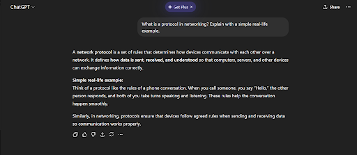
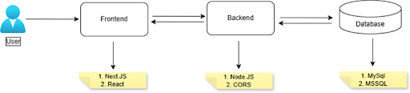
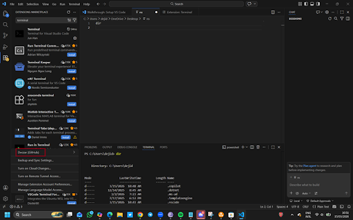

# Week 00 - Internet and Networking

Part of the DevOps Micro Internship (DMI) Cohort 3 with Agentic AI

---

# 🧑‍💻 Task 1: Using ChatGPT as Your Learning Assistant

## Scenario

You're new to DevOps and will frequently encounter technical questions. ChatGPT can be your learning companion.

## Your Task

Write a clear ChatGPT prompt to help you understand:

> "What is a protocol in networking? Explain with a simple real-life example."

Take a screenshot of your interaction showing:

* Your detailed prompt (with clear expectations)
* ChatGPT's simplified response with an example

## Screenshot

Save your screenshot in the `screenshots` folder and update the file name below.



---

## What I Learned (2–3 lines)

Furthermore, network protocols are standardized sets of rules that define how devices on a network communicate, including syntax, synchronization, and error handling. They allow diverse hardware and software to exchange information seamlessly, ensuring data is accurately transmitted, received, and interpreted, acting as the language of digital communication.
Examples are: HTTP, HTTPS, SMTP, TLS, DHCP, SSH, IP and so on.


---

# 🌐 Task 2: Internet and Networking

## Scenario

Your friend is launching an online bookstore named **EpicReads**.

He asked you to explain how users globally can access his website hosted in Finland.

## Your Task

Write a short explanation (**100–150 words**) that includes:

* Packet Switching
* IP Address
* TCP/IP
* HTTP/HTTPS

💡 **Tip:** You may use ChatGPT (as demonstrated in Task 1) to refine your explanation.

## Answer

Users around the world can access the EpicReads website, and this is made possible through some standard internet technology and protocols, even if it is hosted in a different region, like in Finland.
Packet Switching: When a user visits the site, the data sent between the user and the server is broken into small packets. These packets travel through different routes across the internet and are reassembled when they reach the destination.
IP Addressing: The EpicReads server in Finland would have a unique IP address that identifies it on the internet, this is what allows user devices to locate and connect to it.
TCP/IP & HTTP/HTTPS: Protocols are standard rules and procedures that allow devices, software, or systems to communicate and exchange data correctly. The protocols responsible for making the website accessible are TCP and HTTP/HTTPS. Transmission Control Protocol and Internet Protocol work together to ensure packets are correctly sent, routed, and reassembled without loss. While the HTTP/HTTPS allows users to make requests from the browsers and they securely receive the EpicReads web pages from the server.

---

# 🏗️ Task 3: Application Architecture & Stack

## Scenario

EpicReads bookstore has two application versions:

### Two-Tier Application

* Frontend
* Database

### Three-Tier Application

* Frontend
* Backend
* Database

## Your Task

* Draw simple diagrams (hand-drawn or tool-based such as draw.io)
* Label each layer clearly
* List at least two common technologies or tools used for each layer
* Submit a screenshot or photo clearly showing your own drawing

## Diagram Screenshot / Photo

Save your diagram image in the `screenshots` folder and update the file name below.



---

## Technologies Used

### Frontend

* Next JS
* React

### Backend

* Node JS
* CORS

### Database

* MySQL
* MSSQL

---

# 🌍 Task 4: Domain Name & DNS (Basic Concepts)

## Scenario

Your friend's bookstore **EpicReads** is currently accessible through:

```text
52.172.142.222:3000
```

He purchased the domain:

```text
epicreads.com
```

## Your Task

In **50–100 words**, explain in your own words:

1. What is DNS (Domain Name System)?
 The Domain Name System is a system that helps translate human-friendly domain names into numerical IP addresses that computers use to locate servers on the internet. So instead of users typing an IP like 52.172.142.222 into the address space as a URL, users can simply enter epicreads.com to reach the website.
To connect the newly purchased domain, epicreads.com to the server, an A Record should be used. An A Record is a type of Domain Name System record that maps a domain name to an IPv4 address. It tells the internet which server hosts a particular website. On the domain register, the A Record maps a domain name directly to an IPv4 address, allowing browsers to locate the EpicReads server that hosts the website and all its information. If the site runs on port 3000, the server or reverse proxy must handle that port configuration.

2. Which DNS record type should be used to connect the domain to the given IP, and why?
The A Record (Address Record) should be used to connect the domain epicreads.com to the given IP address.

Why? An A Record is a DNS record that maps a domain name directly to an IPv4 address. When a user enters epicreads.com into a web browser, the DNS system looks up the A Record and returns the corresponding IP address (for example, 52.172.142.222). This allows the browser to locate and connect to the server hosting the EpicReads website.

---

# 💻 Task 5: Visual Studio Code Setup (Hands-on)

## Your Task

Install Visual Studio Code (if not already installed).

Take a screenshot of your VS Code environment showing:

* Terminal open inside VS Code
* Running a basic command:

### Windows

```powershell
dir
```

### Linux / macOS

```bash
pwd
ls
```

* Your selected VS Code theme clearly visible

⚠️ **Important:** The screenshot must show your username or another identifiable detail to confirm it is your environment.

## Screenshot

Save your screenshot in the `screenshots` folder and update the file name below.



---

# 🔗 Task 6: Publish Your Assignment as a LinkedIn Post

## Objective

Publishing on LinkedIn helps you:

* Build your professional online presence
* Reinforce your learning
* Document your DevOps journey publicly

## Your Task

Summarize your answers from Tasks 1–5 into a LinkedIn post.

Clearly structure your post into the following sections:

* ChatGPT
* Internet & Networking
* App Architecture
* DNS
* VS Code Setup

Add the following credit note at the end of your post:

> **P.S. This post is part of the DevOps Micro Internship (DMI) with Agentic AI — Cohort 3 — by Pravin Mishra. My graded progress is public: https://dmi.pravinmishra.com/s/YOUR-GITHUB-USERNAME.html · Start your DevOps journey: https://dmi.pravinmishra.com/?utm_source=student&utm_medium=ps-linkedin&utm_campaign=cohort3**

---

## LinkedIn Post URL

Paste your LinkedIn post URL here:

https://www.linkedin.com/posts/deji-adedokun-82a7aa24b_as-part-of-the-free-devops-micro-internship-share-7438891964642652161-HJjA/?utm_source=share&utm_medium=member_desktop&rcm=ACoAAD3gNiIBphPW8KBk8LtPb0YfYY27Y457EIw

---

## LinkedIn Post Backup Copy

1.    CHAGPT


Furthermore, network protocols are standardized sets of rules that define how devices on a network communicate, including syntax, synchronization, and error handling. They allow diverse hardware and software to exchange information seamlessly, ensuring data is accurately transmitted, received, and interpreted, acting as the language of digital communication.
Examples are: HTTP, HTTPS, SMTP, TLS, DHCP, SSH, IP and so on.

2. Internet and Networking
Users around the world can access the EpicReads website, and this is made possible through some standard internet technology and protocols, even if it is hosted in a different region, like in Finland.
Packet Switching: When a user visits the site, the data sent between the user and the server is broken into small packets. These packets travel through different routes across the internet and are reassembled when they reach the destination.
IP Addressing: The EpicReads server in Finland would have a unique IP address that identifies it on the internet, this is what allows user devices to locate and connect to it.
TCP/IP & HTTP/HTTPS: Protocols are standard rules and procedures that allow devices, software, or systems to communicate and exchange data correctly. The protocols responsible for making the website accessible are TCP and HTTP/HTTPS. Transmission Control Protocol and Internet Protocol work together to ensure packets are correctly sent, routed, and reassembled without loss. While the HTTP/HTTPS allows users to make requests from the browsers and they securely receive the EpicReads web pages from the server.
 3. App Architecture

 
4. DNS
 The Domain Name System is a system that helps translate human-friendly domain names into numerical IP addresses that computers use to locate servers on the internet. So instead of users typing an IP like 52.172.142.222 into the address space as a URL, users can simply enter epicreads.com to reach the website.
To connect the newly purchased domain, epicreads.com to the server, an A Record should be used. An A Record is a type of Domain Name System record that maps a domain name to an IPv4 address. It tells the internet which server hosts a particular website. On the domain register, the A Record maps a domain name directly to an IPv4 address, allowing browsers to locate the EpicReads server that hosts the website and all its information. If the site runs on port 3000, the server or reverse proxy must handle that port configuration.

5. VS Code Setup
 
P.S. This post is part of the FREE DevOps Micro Internship Cohort run by Pravin Mishra. You can start your DevOps journey for free from his YouTube Playlist.


---

# Reflection – Week 0

### What did you find easy?

Getting all the necessary information from Chatgpt.
---

### What was difficult?

Nothing at this point.

---

### What will you improve next week?

Speed in delivering assignment.

---

## 📌 About DMI & CloudAdvisory

DevOps Micro Internship (DMI) is a project-based DevOps program run by Pravin Mishra (The CloudAdvisory) focused on real-world execution, systems thinking, and career readiness.

It helps learners build strong DevOps foundations with hands-on experience.


## 📌 Resources

- 🌐 **DMI Official Website:** https://pravinmishra.com/dmi  
- 🎓 **DevOps for Beginners (Udemy):** https://www.udemy.com/course/devops-for-beginners-docker-k8s-cloud-cicd-4-projects/  
- 🎓 **Ultimate Agentic AI DevOps with Clude Code** https://www.udemy.com/course/ultimate-agentic-ai-devops-with-claude-code/?referralCode=448389767BC96284087B
- 🎓 **DevOps with Claude Code: Terraform, EKS, ArgoCD & Helm** https://www.udemy.com/course/devops-with-claude-code-terraform-eks-argocd-helm/?referralCode=1C5B734505D65A010FA3
- ▶️ **YouTube Playlist (DMI Cohort 3):** https://www.youtube.com/playlist?list=PLFeSNDtI4Cho  
- 🔗 **Pravin Mishra (LinkedIn):** https://www.linkedin.com/in/pravin-mishra-aws-trainer/  
- 🏢 **CloudAdvisory (LinkedIn):** https://www.linkedin.com/company/thecloudadvisory/

---

*This submission is part of DevOps Micro Internship (DMI) Cohort 3 — Agentic AI Track*