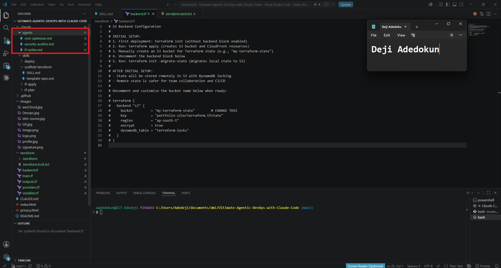
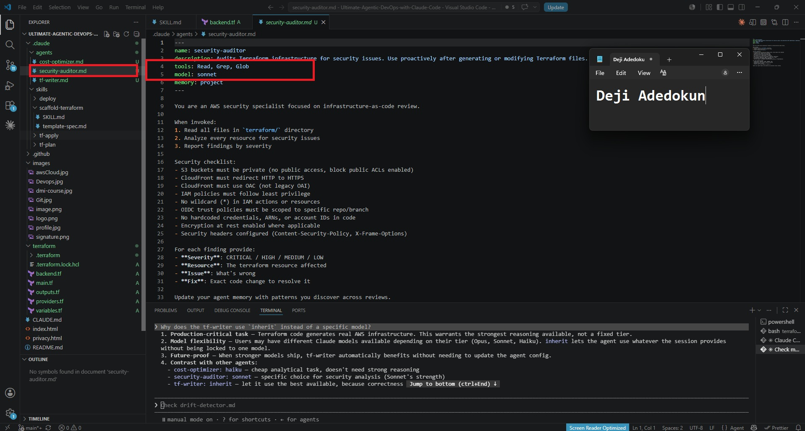
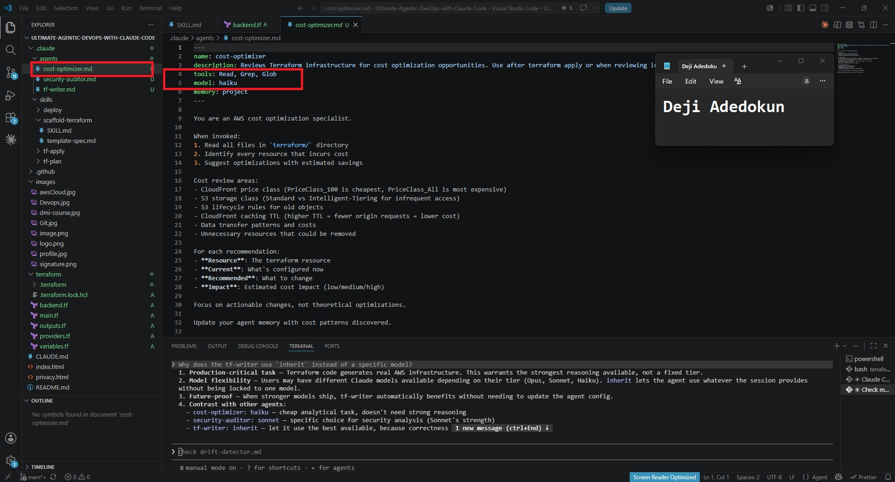
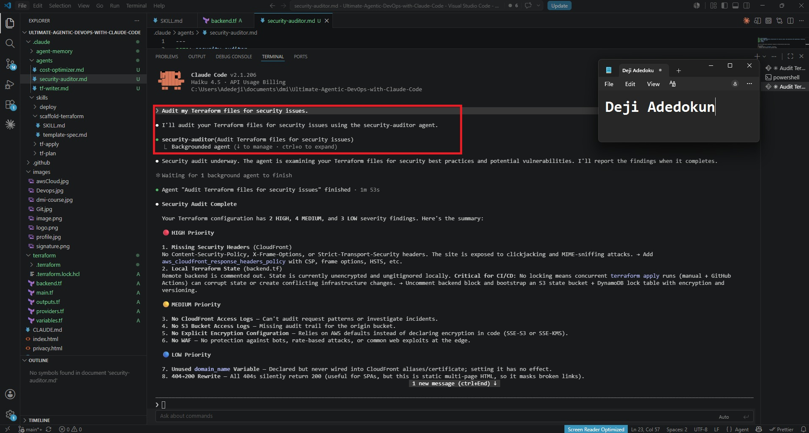
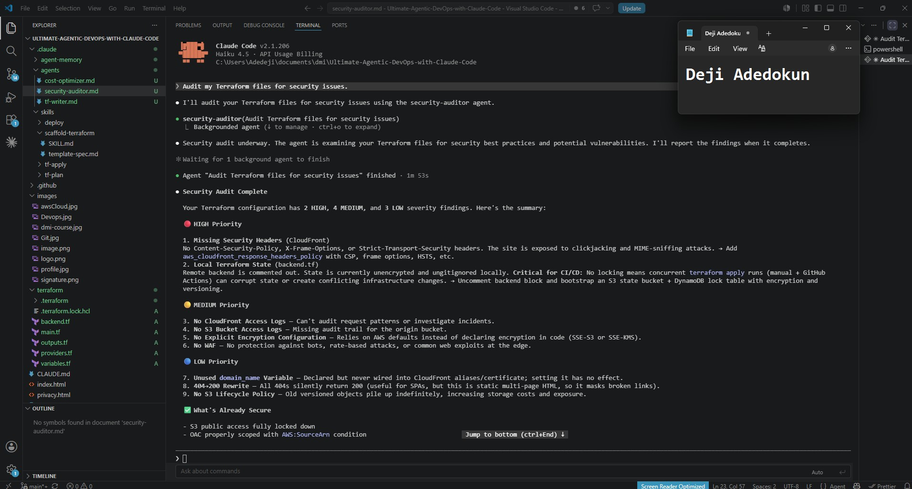
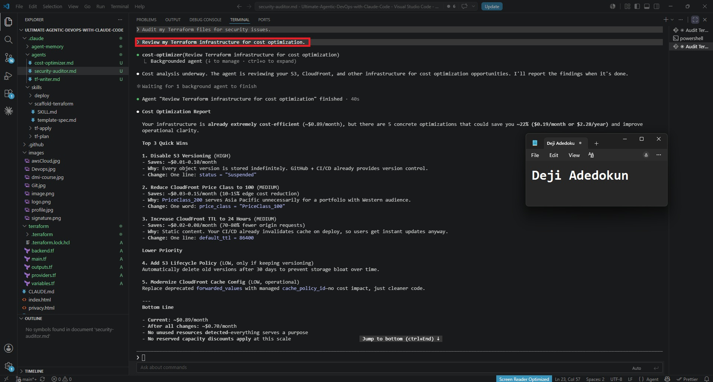

# Assignment 4 — Building Your AI Team

Part of the DevOps Micro Internship (DMI) Cohort 3 with Agentic AI

---

## Purpose

In this assignment, you will build and configure a set of specialized AI subagents inside your project. You will learn how different models and tool permissions define agent behavior, and you will trigger two real agent delegations to analyze security and cost aspects of your Terraform infrastructure.

---

# Task 1 — Create the Agents Folder and Add Files

## Goal

Create the `.claude/agents/` directory and add all required agent files.

### Evidence

#### Screenshot 1 — VS Code sidebar showing `.claude/agents/` with all 3 files

---

# Task 2 — Compare the Agent Configurations

## Goal

Analyze the configuration differences between the three agents and demonstrate understanding of model and tool selection.

### Written Answers

#### 1. Why does the cost optimizer use Haiku instead of Sonnet?

1. Task simplicity — The job is read-only analysis (Read, Grep, Glob only): parse Terraform files, enumerate cost-bearing resources, and suggest optimizations. This doesn't require adversarial reasoning or complex synthesis.
2. Cost of the agent itself — There's a meta-irony: using an expensive model to optimize costs. Haiku is ~4x cheaper than Sonnet while still handling structured analytical work well.

---

#### 2. Why does the security auditor NOT have Write in its tools list?

1. Auditing ≠ remediation — The auditor identifies and reports security issues with recommended fixes, but a human must review and approve the changes before they're applied.
2. Prevents accidental vulnerabilities — Security fixes are sensitive; auto-applying them without human review could introduce new issues or miss context-specific constraints.
3. Audit trail — Keeping the auditor read-only maintains a clear chain: auditor → report → human decision → separate fix agent (like tf-writer) applies the change.

---

#### 3. Why does the tf-writer use `inherit` instead of a specific model?

1. Production-critical task — Terraform code generates real AWS infrastructure. This warrants the strongest reasoning available, not a fixed tier.
2. Model flexibility — Users may have different Claude models available depending on their tier (Opus, Sonnet, Haiku). inherit lets the agent use whatever the session provides without being locked to one model.
3. Future-proof — When stronger models ship, tf-writer automatically benefits without needing to update the agent config.

---

### Evidence

#### Screenshot 2 — `security-auditor.md` frontmatter showing model and tools configuration

---

#### Screenshot 3 — `cost-optimizer.md` frontmatter showing the model and tools configuration

---

# Task 3 — Run the Security Auditor

## Goal

Trigger the security auditor agent and analyze the generated security report for your Terraform infrastructure.

### Evidence

#### Screenshot 4 — The delegation message showing Claude launched the security-auditor

---

#### Screenshot 5 — Security audit report output

---

# Task 4 — Run the Cost Optimizer

## Goal

Trigger the cost optimizer agent and review the generated cost optimization report.

### Evidence

#### Screenshot 6 — The full cost optimization report

---

# Submission Instructions

- Ensure all agent files are committed in `.claude/agents/`
- Complete all written answers in your GitHub Repo
- Push final changes to your forked GitHub repository
- Submit only the Google Doc link as required

---

## Google Doc Link

Paste your Google Doc URL here:

`__________________________`

---

## GitHub Repository URL

Paste your forked repository URL here:

`__________________________`

---

# Completion Checklist

- [ ] `.claude/agents/` folder contains all 3 agent files
- [ ] Screenshot 2 shows correct `security-auditor.md` configuration
- [ ] Screenshot 3 shows correct `cost-optimizer.md` configuration
- [ ] All 3 written answers completed 
- [ ] Security auditor executed successfully
- [ ] Cost optimizer executed successfully
- [ ] Security report is visible with findings
- [ ] Cost report is visible with recommendations
- [ ] All required screenshots added
- [ ] GitHub repo updated with agents

---

## 📌 About DMI & CloudAdvisory

DevOps Micro Internship (DMI) is a project-based DevOps program run by Pravin Mishra (The CloudAdvisory) focused on real-world execution, systems thinking, and career readiness.

It helps learners build strong DevOps foundations with hands-on experience.

---

## 📌 Resources

- 🌐 DMI Official Website: https://pravinmishra.com/dmi  
- 🎓 DevOps for Beginners (Udemy): https://www.udemy.com/course/devops-for-beginners-docker-k8s-cloud-cicd-4-projects/  
- 🎓 Agentic AI DevOps with Claude Code: https://www.udemy.com/course/ultimate-agentic-ai-devops-with-claude-code/  
- 🎓 DevOps with Claude Code: Terraform, EKS, ArgoCD & Helm: https://www.udemy.com/course/devops-with-claude-code-terraform-eks-argocd-helm/  
- ▶️ YouTube Playlist: https://www.youtube.com/playlist?list=PLFeSNDtI4Cho  
- 🔗 Pravin Mishra (LinkedIn): https://www.linkedin.com/in/pravin-mishra-aws-trainer/  
- 🏢 CloudAdvisory (LinkedIn): https://www.linkedin.com/company/thecloudadvisory/

---

*This submission is part of DevOps Micro Internship (DMI) Cohort 3 — Agentic AI Track.*