# Assignment 3 — Production Maintenance Drill (OPS Checklist)

Part of the DevOps Micro Internship (DMI) Cohort 3 with Agentic AI

---

## Purpose

In this assignment, you will treat your already deployed React application (on Ubuntu VM with Nginx) as a live production system. You will perform structured operational checks covering network validation, service health, log analysis, resource monitoring, configuration verification, and incident simulation with recovery — mirroring real on-call DevOps responsibilities.

---

# Task 1 — Server Access & Networking Validation

## Goal

Verify that the deployed React application is reachable from the browser and confirm basic network connectivity of the Ubuntu VM.

### Evidence

#### Screenshot 1 — Browser showing the React app with your Full Name visible on the UI

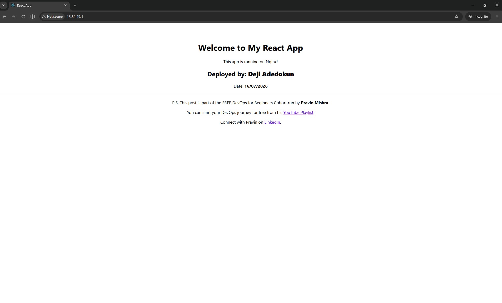

---

#### Screenshot 2 — Output of `ip a`

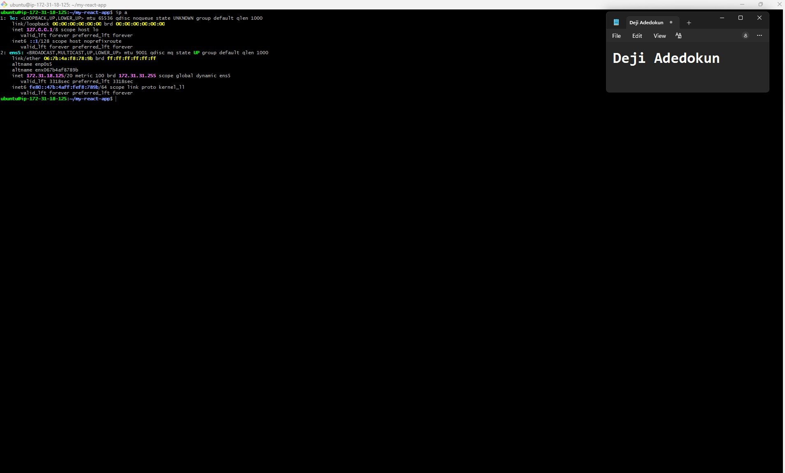

---

#### Screenshot 3 — Output of `sudo ss -tulpen`

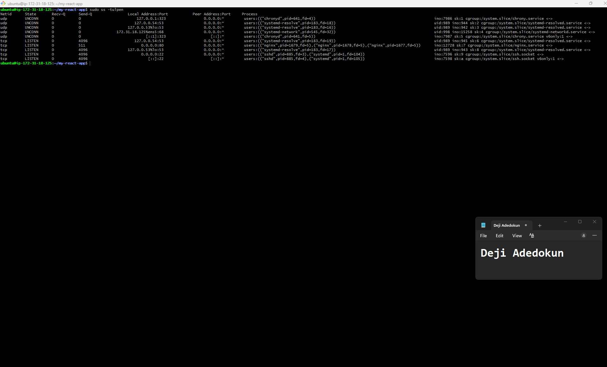

---

#### Screenshot 4 — Output of `sudo ufw status`

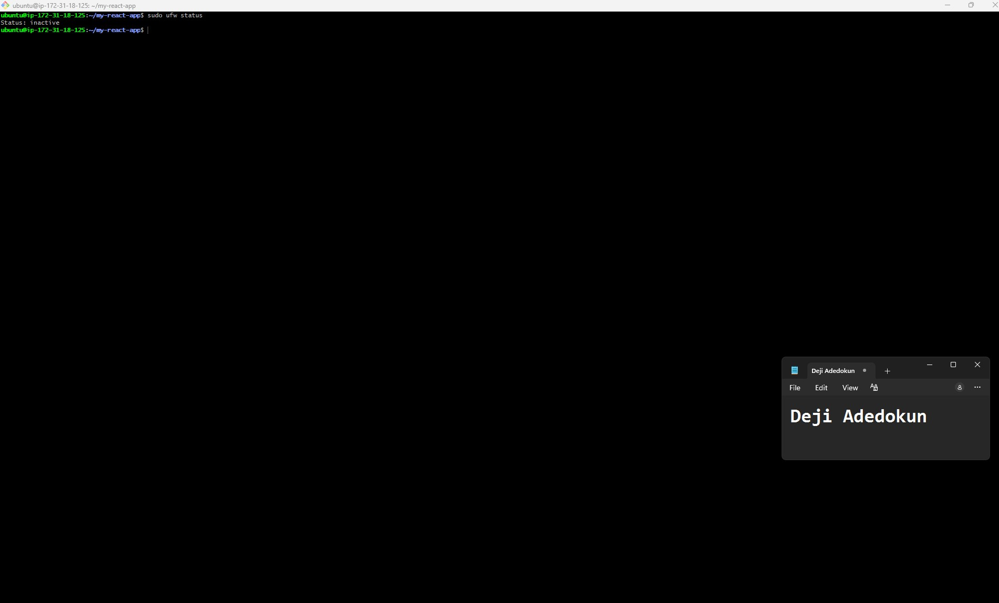

---

### Notes

Answer the following in your own words:

**1. What proves Nginx is listening on 0.0.0.0:80?**

To prove Nginx is listening on 0.0.0.0:80, the listening sockets will need to be checked via sudo ss -tlnp | grep ':80'. This is a command line that shows if a process is listening on port 80. ss - displays network sockets, -tlnp (t - Show TCP sockets only. l - Show listening sockets only. n - Show numeric addresses and ports (don't resolve names). p - Show the process using the socket.) all to filter through the connection swith port 80.

---

**2. What proves SSH is active on port 22?**

Running sudo ss -tlnp | grep ':22' to check processes that are listening on port 22.

---

**3. Did you find any unexpected open ports? Explain briefly.**

No unexpected open ports. As expected Nginx was listening on port 80 and the Secure Shell Daemon (sshd) on port 22.

---

# Task 2 — Service Health & Systemd Validation (Nginx)

## Goal

Verify that Nginx is properly installed, running, enabled at boot, and safely configured.

### Evidence

#### Screenshot 1 — Output of `systemctl status nginx --no-pager`

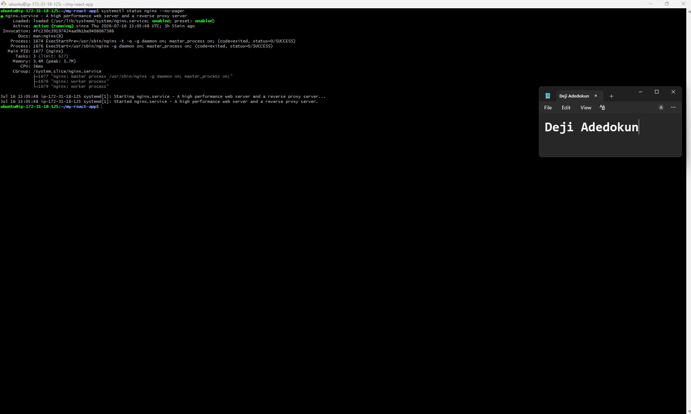

---

#### Screenshot 2 — Output of `sudo nginx -t`

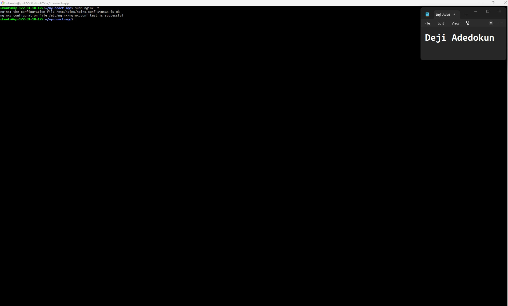

---

#### Screenshot 3 — Output of `sudo ss -lptn '( sport = :80 )'`

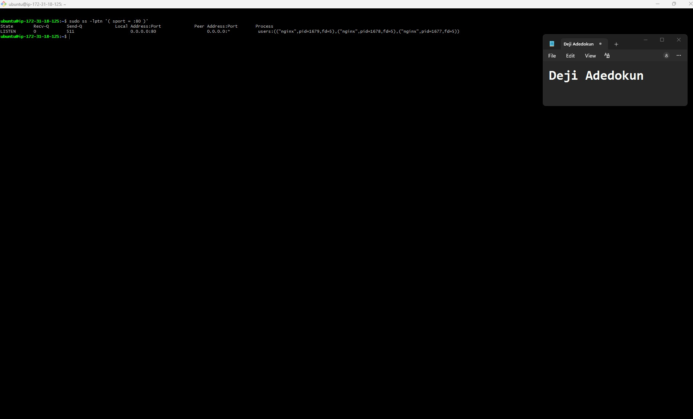

---

### Notes

Answer the following in your own words:

**1. What happens if Nginx fails to restart in production?**

If Nginx fails to restart it would simply mean visitors would be refused connectiont o the server or timeout or site fully down.

---

**2. What's your basic rollback plan?**

The server failing to restart might be due to maybe config has a syntax error, the port already being used  or a required file is missing. It is advisable to configure rollback or full app restart.

---

# Task 3 — Logs & Request Trace

## Goal

Verify real traffic flow and analyze logs to understand system behavior and errors.

### Evidence

#### Screenshot 1 — Output of `sudo tail -n 30 /var/log/nginx/access.log`

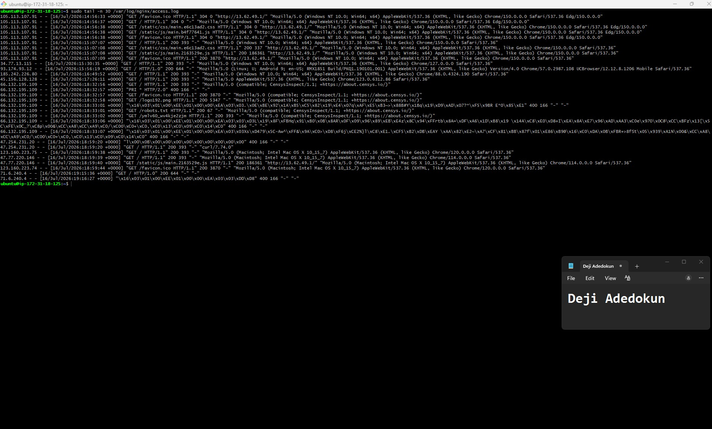

---

#### Screenshot 2 — Output of `sudo tail -n 30 /var/log/nginx/error.log`

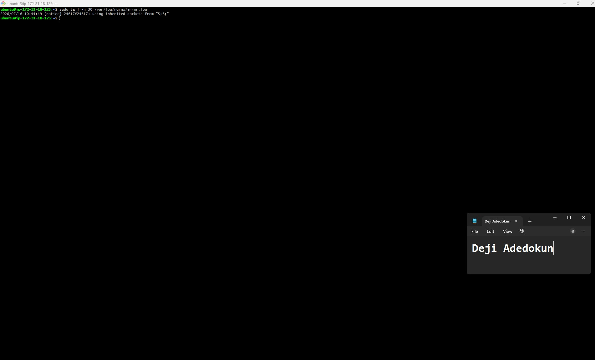

---

#### Screenshot 3 — Output of `sudo journalctl -u nginx --no-pager -n 50`

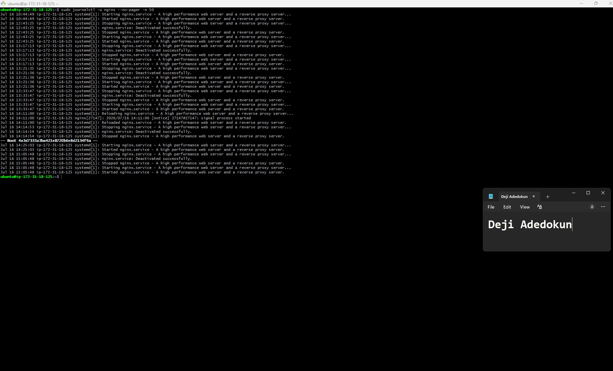

---

### Notes

Answer the following in your own words:

**1. Were there any errors in the logs?**

- If yes, mention 1–2 example error lines from the logs and explain what each one means in simple terms.
- If no, explain what it means if the error log is empty or shows no recent errors during your check.

It probably means there are actually no errors to report or errors redirecting to some other location.

---

**2. If there were no errors, what does that indicate about the system?**

In my case, it seems there are errors but it is redirected to a different location.

---

**3. Based on the access logs, were your curl requests visible in the log entries? What does that prove about traffic flow?**

Yes, there were curl requests and it proves that the server got a valid HTTP response.

---

# Task 4 — System Resource Health Check (Capacity Red Flags)

## Goal

Assess server capacity and detect potential performance or failure risks.

### Evidence

#### Screenshot 1 — Output of `uptime`

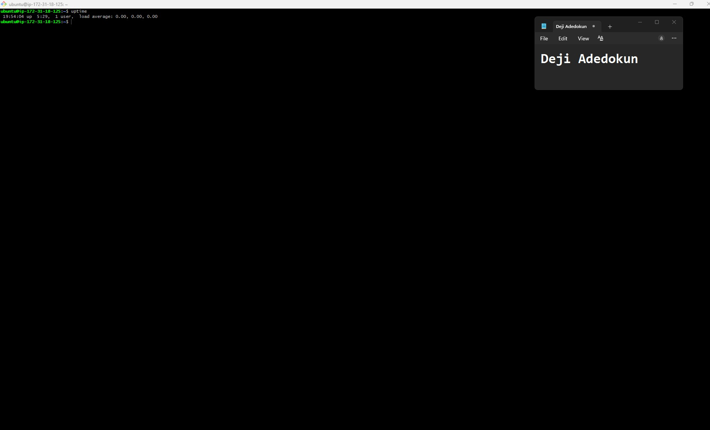

---

#### Screenshot 2 — Output of `free -h`

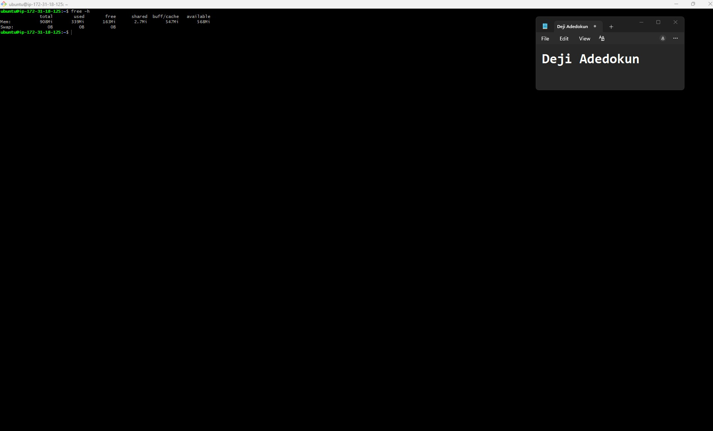

---

#### Screenshot 3 — Output of `df -h`

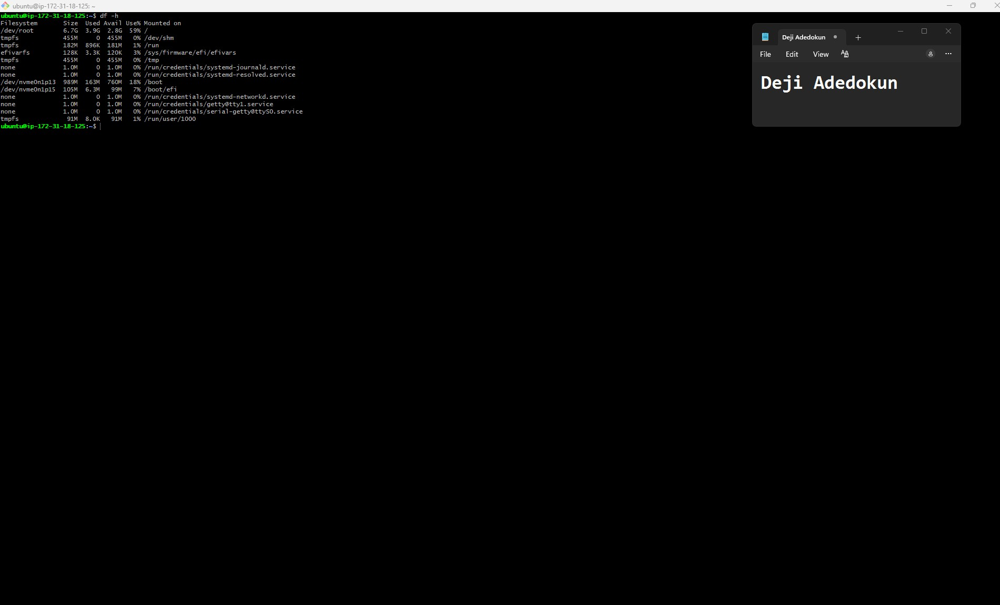

---

#### Screenshot 4 — Output of `sudo du -sh /var/* | sort -h`

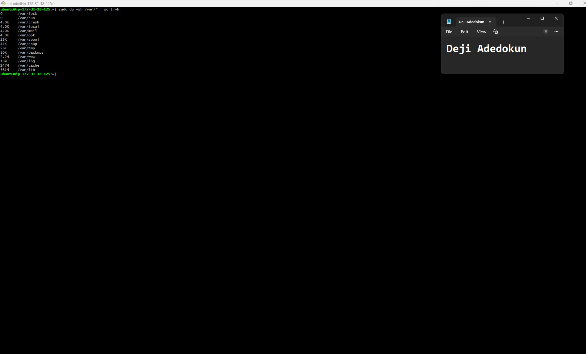

---

### Notes

Answer the following in your own words:

**1. Which resource looks most critical right now? (CPU/load, memory, or disk) Explain why.**

Currently looks like the disk cause of the content of locations like the root and lib.

---

**2. What happens if disk becomes 100% full in a production server?**

Several things will most likely occur. The database becomes unustable, application stops writing data, data retrieval becomes delayed, services may crash, user requests will fail.

---

# Task 5 — Configuration & Deployment Verification

## Goal

Ensure the correct React build is deployed and Nginx is serving it properly.

### Evidence

#### Screenshot 1 — Output of `ls -lah /var/www/html | head -n 20`

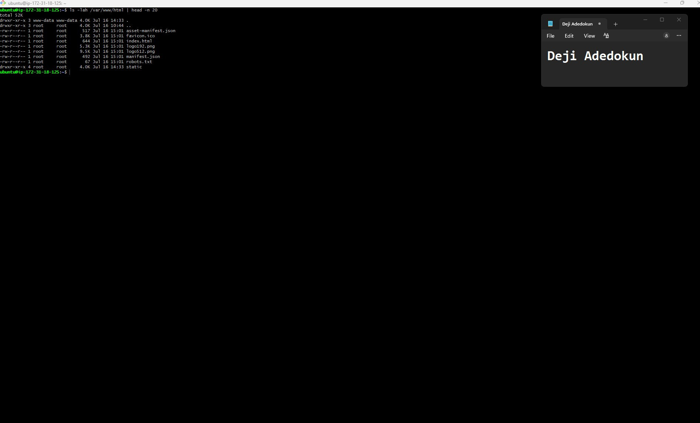

---

#### Screenshot 2 — Output of `grep -R "Deployed by" -n /var/www/html 2>/dev/null | head`

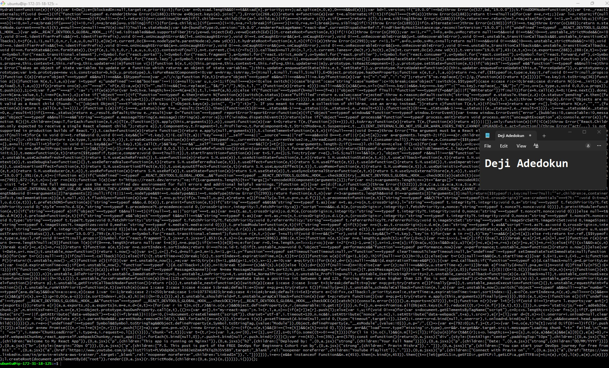

---

#### Screenshot 3 — Output of `grep -n "try_files" /etc/nginx/sites-available/default`

---

### Notes

Answer the following in your own words:

**1. How do you confirm that the correct version of the application is deployed?**

Write your answer here.
By checking the version of the installation (e.g. nginx -v)
---

# Task 6 — Nginx Configuration Failure Simulation

## Goal

Simulate a real-world Nginx misconfiguration and recover the service safely.

#### Screenshot 1 — Output of `sudo nginx -t` showing the syntax error (broken config)

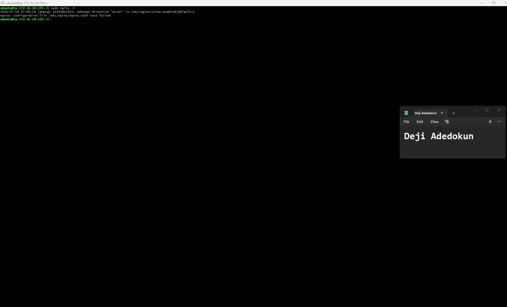

---

#### Screenshot 2 — Output of `sudo nginx -t` showing syntax ok (fixed config)

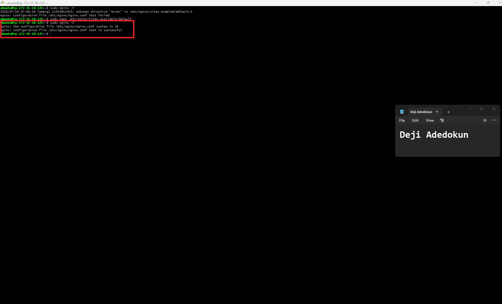

---

#### Screenshot 3 — Output of `curl -I http://<public-ip>` confirming recovery (200 OK)

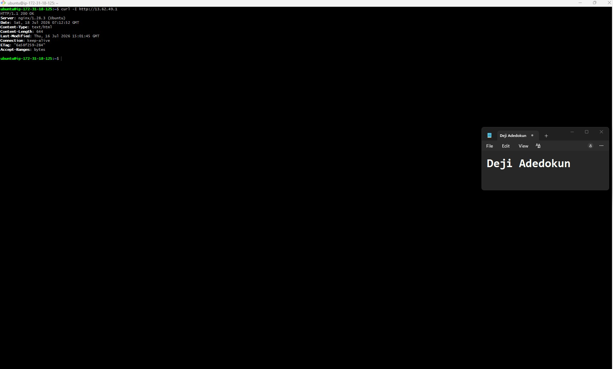

---

### Notes

Answer the following in your own words:

**1. What caused the configuration failure?**

The content of location /etc/nginx/sites-available/default was altered and not accurate.

---

**2. How did you fix the issue?**

Ensured the configuration on /etc/nginx/sites-available/default was accurate, edited via nano and saved as expected.

---

**3. How can you avoid this kind of issue in real production systems?**

Always validate and test the configuration via sudo nginx -t

---

# Task 7 — Web Application Failure Simulation

## Goal

Simulate missing deployment content and recover the application safely.

### Evidence

#### Screenshot 1 — Output of `curl -I http://<public-ip>` showing failure (non-200 response)

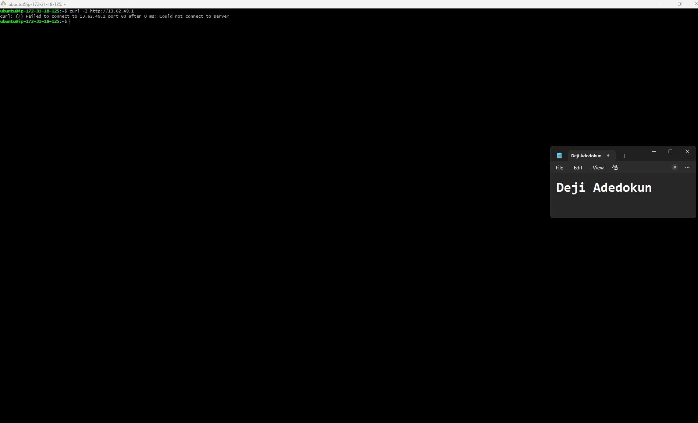

---

#### Screenshot 2 — Output of `curl -I http://<public-ip>` confirming recovery (200 OK)

---

### Notes

Answer the following in your own words:

**1. What caused the application to break in this scenario?**

In this scenario the listening port for the server was wrong and not set to 80. 

---

**2. How did you fix the issue and restore the application?**

This was corrected by editing the configuration file and setting listening port to 80, nginx restarted (via systemctl restart nginx) and the public ip was reachable.

---

**3. What steps would you take to prevent this kind of issue in real production systems?**

Always validate accuracy of configuration files.

---

# Task 8 — Security & Reliability Review

## Goal

Review and reflect on the security and reliability practices applied during this assignment.

### Security & Reliability Notes

Answer the following in your own words:

**1. Why is SSH key-based authentication more secure than sharing passwords?**

SSH key-based authentication is more secure than sharing passwords because it uses public-key cryptography, where a private key remains securely on the user's device and is never transmitted over the network, making it far more resistant to theft, guessing, and brute-force attacks.

---

**2. Why should only required ports be open on a production server?**

Only the required ports should be open on a production server because every open port represents a potential entry point for attackers. By limiting access to only the services that are necessary, such as port 80 for HTTP, port 443 for HTTPS, or port 22 for SSH when needed, organizations reduce their attack surface and lower the risk of unauthorized access, vulnerability exploitation, malware infections, and denial-of-service attacks.

---

**3. Why is it important for Nginx to be enabled on boot?**

It is important for Nginx to be enabled on boot because it ensures that the web server starts automatically whenever the server is restarted, whether due to maintenance, updates, power outages, or unexpected crashes.

---

**4. What are the risks of sharing secrets, keys, or credentials publicly?**

Sharing secrets, keys, or credentials publicly is extremely risky because it can give unauthorized individuals direct access to servers, applications, databases, cloud environments, and sensitive data.

---

**5. Why should cloud resources be stopped or terminated when they are no longer needed?**

Cloud resources should be stopped or terminated when they are no longer needed because most cloud services operate on a pay-as-you-go model, meaning organizations continue to incur charges for resources that remain running even if they are not being used.

---

# LinkedIn Post (Required)

## Evidence

#### LinkedIn Post URL

Paste your LinkedIn post URL here:

`https://www.linkedin.com/posts/deji-adedokun-82a7aa24b_the-dmi-sessions-have-highlighted-the-importance-share-7484153094998708224-eAt_/?utm_source=share&utm_medium=member_desktop&rcm=ACoAAD3gNiIBphPW8KBk8LtPb0YfYY27Y457EIw`

---

#### Screenshot — Published LinkedIn post

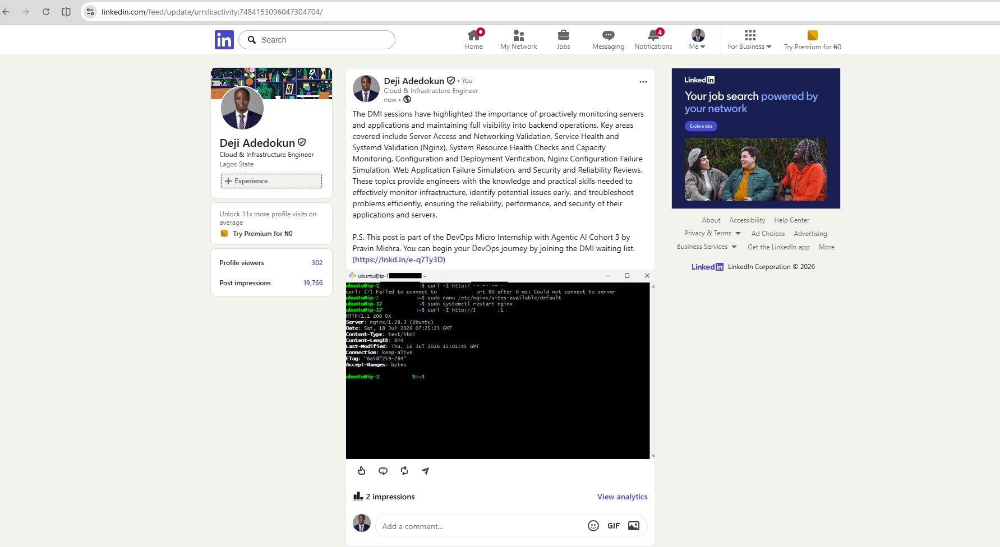

---

# Submission Instructions

- Add all required screenshots in your submission
- Full name must be visible in required screenshots
- Do not expose sensitive information (keys, passwords, account IDs)

---

# Completion Checklist

- [ ] Task 1: Screenshots (browser, ip a, ss -tulpen, ufw status) + Notes answered
- [ ] Task 2: Screenshots (nginx status, nginx -t, ss port 80) + Notes answered
- [ ] Task 3: Screenshots (access log, error log, journalctl) + Notes answered
- [ ] Task 4: Screenshots (uptime, free -h, df -h, du -sh) + Notes answered
- [ ] Task 5: Screenshots (ls html, grep deployed by, grep try_files) + Notes answered
- [ ] Task 6: Screenshots (nginx -t fail, nginx -t pass, curl recovery) + Notes answered
- [ ] Task 7: Screenshots (curl failure, curl recovery) + Notes answered
- [ ] Task 8: Security & Reliability Notes answered
- [ ] LinkedIn post published and URL submitted
- [ ] Full Name visible in all required screenshots
- [ ] No sensitive data exposed

---

## 📌 About DMI & CloudAdvisory

DevOps Micro Internship (DMI) is a project-based DevOps program run by Pravin Mishra (The CloudAdvisory) focused on real-world execution, systems thinking, and career readiness.

It helps learners build strong DevOps foundations with hands-on experience.

---

## 📌 Resources

- 🌐 DMI Official Website: https://pravinmishra.com/dmi  
- 🎓 DevOps for Beginners (Udemy): https://www.udemy.com/course/devops-for-beginners-docker-k8s-cloud-cicd-4-projects/  
- 🎓 Agentic AI DevOps with Claude Code: https://www.udemy.com/course/ultimate-agentic-ai-devops-with-claude-code/  
- 🎓 DevOps with Claude Code: Terraform, EKS, ArgoCD & Helm: https://www.udemy.com/course/devops-with-claude-code-terraform-eks-argocd-helm/  
- ▶️ YouTube Playlist: https://www.youtube.com/playlist?list=PLFeSNDtI4Cho  
- 🔗 Pravin Mishra (LinkedIn): https://www.linkedin.com/in/pravin-mishra-aws-trainer/  
- 🏢 CloudAdvisory (LinkedIn): https://www.linkedin.com/company/thecloudadvisory/

---

*This submission is part of DevOps Micro Internship (DMI) Cohort 3 — Agentic AI Track.*