# Assignment 5 — Bash Script Automation Drill (OPS Checklist)

Part of the DevOps Micro Internship (DMI) Cohort 3 with Agentic AI

---

## Purpose

In this assignment, you will practice Bash scripting by building a series of small automation scripts covering environment setup, variables, arrays, loops, file conditionals, if-else logic, and functions. These scripts form the foundation of real-world Linux automation used in DevOps, cloud, and production support environments.

---

# Task 1 — Bash Environment & Workspace Setup

## Goal

Verify that Bash is available on your system and create a clean workspace for this assignment.

### Evidence

#### Screenshot 1 — Output of `echo $SHELL` and `bash --version`

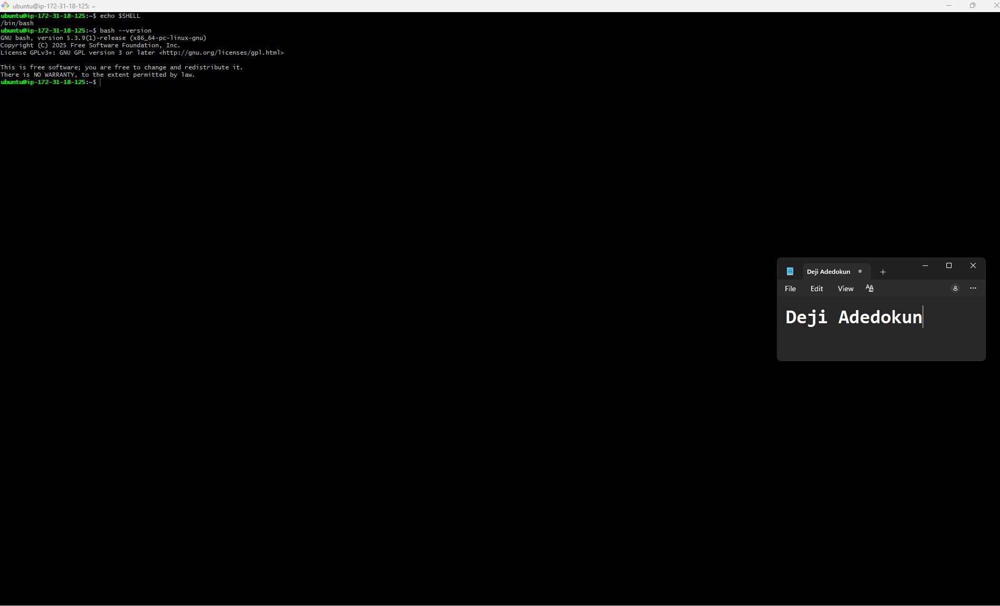

---

#### Screenshot 2 — Output of `pwd` and `ls -lah` showing the scripts directory

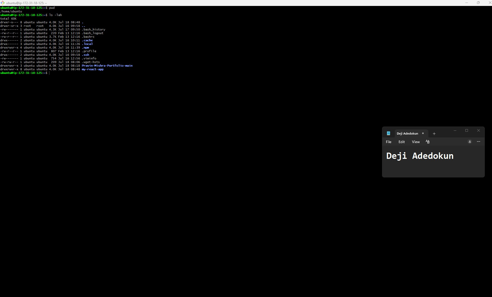

---

### Notes

Answer the following in your own words:

**1. What is Bash?**

Bash, which stands for Bourne Again Shell, is a powerful command-line shell and scripting language used to interact directly with an operating system through typed commands. As the default shell for most Linux distributions and macOS, Bash is widely utilized by developers, system administrators, and DevOps professionals to manage files, automate repetitive tasks, execute programs, and administer systems efficiently. Its scripting capabilities also enable users to create automated workflows, making it an essential tool for system management, software development, and infrastructure operations.

---

**2. What is the difference between shell and Bash?**

A shell is a command-line program that allows users to interact with an operating system by executing commands and running scripts, while Bash (Bourne Again Shell) is a specific type of shell.

---

**3. Why is it important to confirm the Bash version before writing scripts?**

It is important to confirm the Bash version before writing scripts because different Bash versions support different features, syntax, and built-in commands. A script that works correctly on a newer version of Bash may fail on an older system if it uses unsupported functionality, leading to errors and compatibility issues. So most importantly is to avoid compartibility issues.

---

# Task 2 — Your First Bash Script

## Goal

Create your first Bash script, make it executable, and run it from the terminal.

### Evidence

#### Screenshot 1 — Content of `first-script.sh`

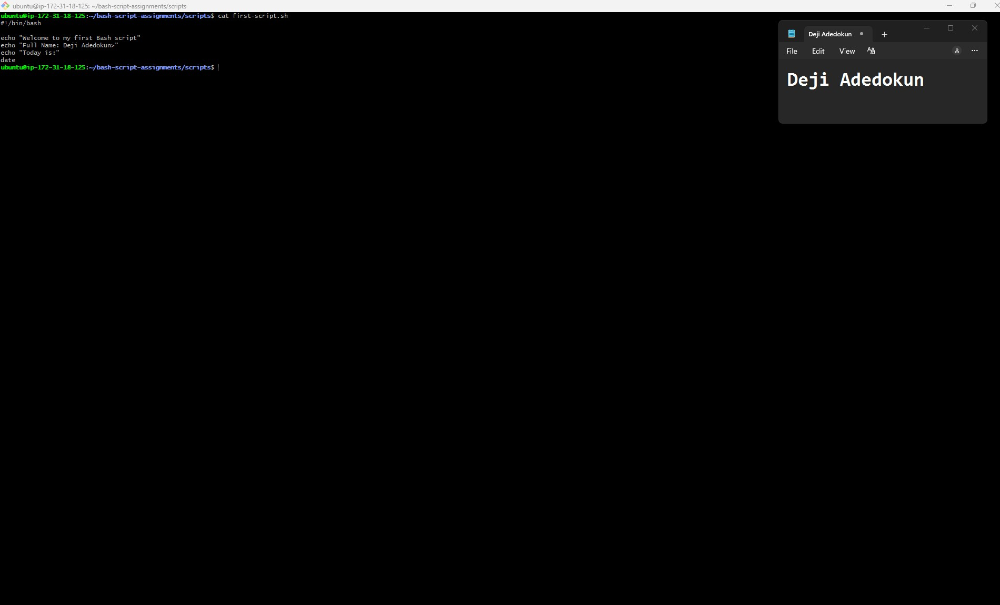

---

#### Screenshot 2 — Output of `./first-script.sh`

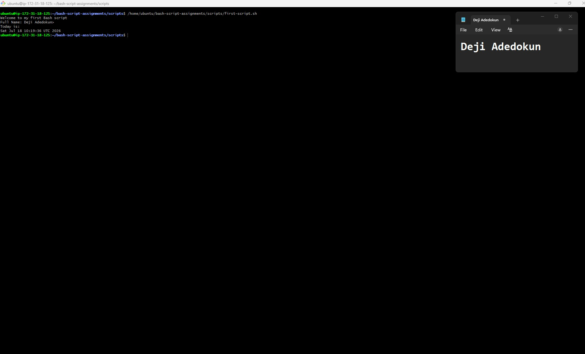

---

#### Screenshot 3 — Output of `ls -l first-script.sh` showing executable permission

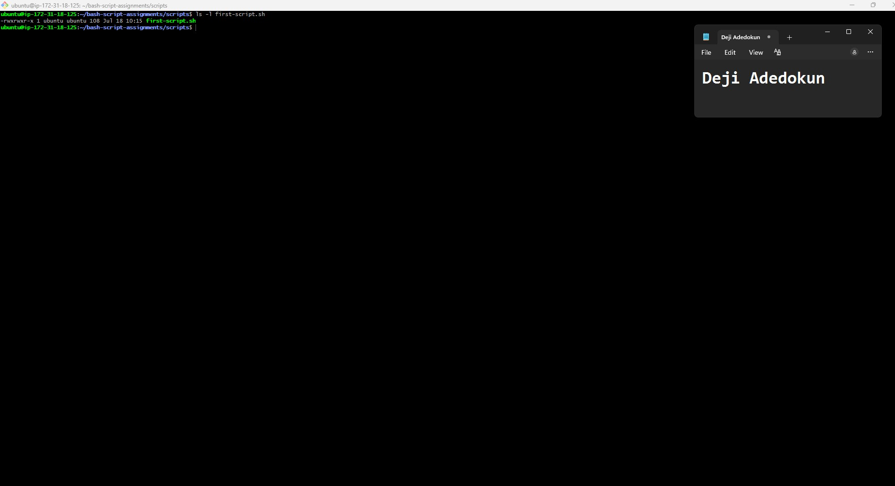

---

### Notes

Answer the following in your own words:

**1. What is the purpose of `#!/bin/bash`?**

This is called a shebang. It tells the operating system which interpreter should be used to execute the script. In this case, it instructs the system to run the script using the Bash shell located at /bin/bash.

---

**2. Why do we use `chmod +x` before running a script?**

This is to grant the script the necessary execute permission.

---

**3. What is the difference between running a script using `./script.sh` and `bash script.sh`?**

The difference between ./script.sh and bash script.sh lies in how the script is executed. Running ./script.sh executes the script directly as a program, which requires the script to have execute permissions (chmod +x) and typically relies on the shebang line (such as #!/bin/bash) to determine which interpreter should run the script. In contrast, running bash script.sh explicitly invokes the Bash interpreter to execute the script, so execute permissions are not required, and the shebang line is ignored. While both methods can produce the same result, ./script.sh treats the script as an executable file, whereas bash script.sh passes the script directly to the Bash shell for execution.

---

# Task 3 — Variables: User Information Script

## Goal

Use variables to store and display user-related information.

### Evidence

#### Screenshot 1 — Content of `user-info.sh`

---

#### Screenshot 2 — Output of `./user-info.sh`

---

### Notes

Answer the following in your own words:

**1. What is a variable in Bash?**

Similar to coding/programming, a variable in Bash is a named storage location used to hold data that can be referenced and reused within a script or command-line session. 

---

**2. Why should we avoid spaces around the `=` sign when creating variables?**

Bash interprets spaces as separators between commands and arguments.

---

**3. How do you access the value stored inside a Bash variable?**

To access the value stored inside a Bash variable, use the variable name preceded by the $ symbol.

---

# Task 4 — Arrays & Loops: Tools Checklist Script

## Goal

Use arrays and loops to print a checklist of tools used in Bash scripting.

### Evidence

#### Screenshot 1 — Content of `tools-checklist.sh`

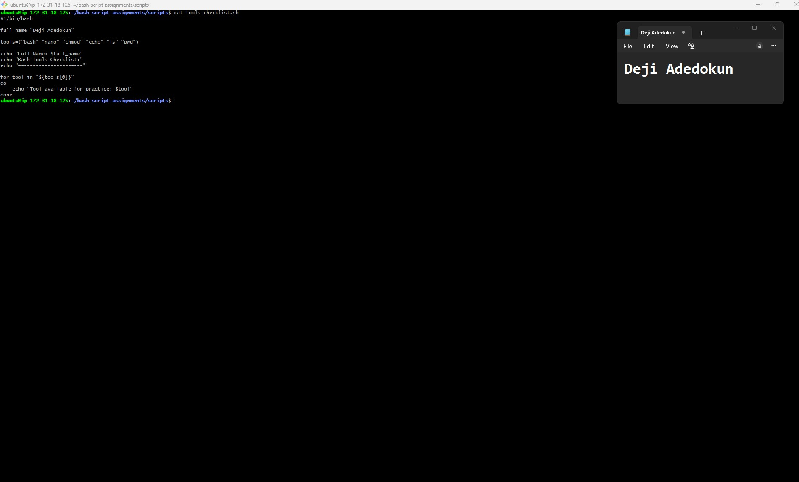

---

#### Screenshot 2 — Output of `./tools-checklist.sh`

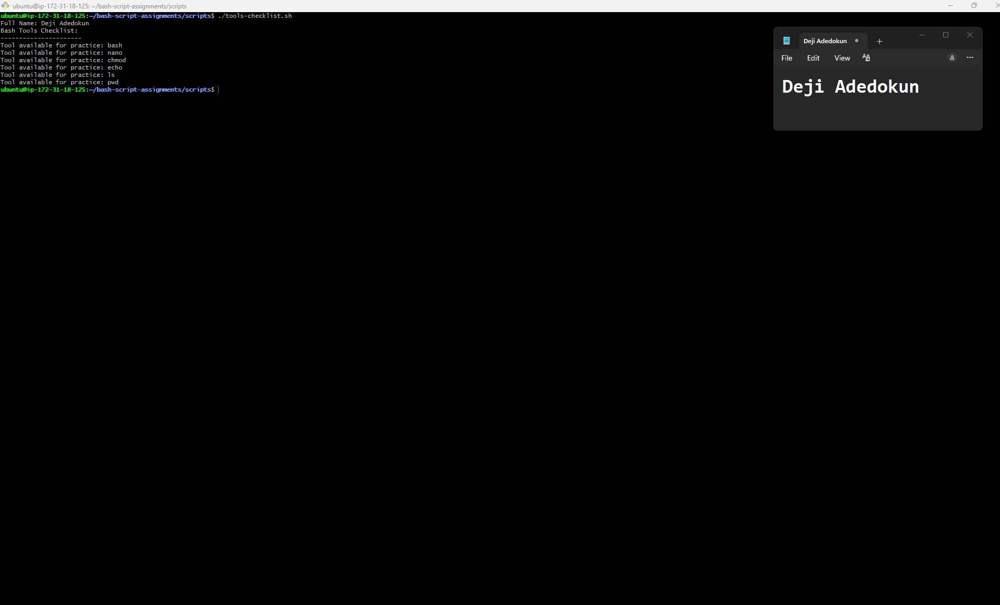

---

### Notes

Answer the following in your own words:

**1. What is an array in Bash?**

An array in Bash is a variable that can store multiple values under a single name. Instead of creating separate variables for related data, an array allows you to group several values together and access them using an index.

---

**2. Why are arrays useful in scripts?**

Arrays are useful in Bash because they allow you to store and manage multiple related values within a single variable. This makes scripts more organized and efficient, especially when working with lists of items such as filenames, server names, user accounts, or directories. Instead of creating multiple variables for each value, you can store them all in one array and process them using loops or index references

---

**3. What does `"${tools[@]}"` mean?**

In Bash, "${tools[@]}" is used to access all the elements of an array named tools.

---

**4. What is the purpose of the `for` loop in this script?**

The purpose of the for loop in this script is to iterate through each item in the tools array and display it one at a time. Instead of writing multiple echo statements for each tool, the loop automatically processes every element in the array, making the script shorter, more efficient, and easier to maintain.

---

# Task 5 — Loops: Number Counter Script

## Goal

Use loops to repeat a task multiple times.

### Evidence

#### Screenshot 1 — Content of `counter.sh`

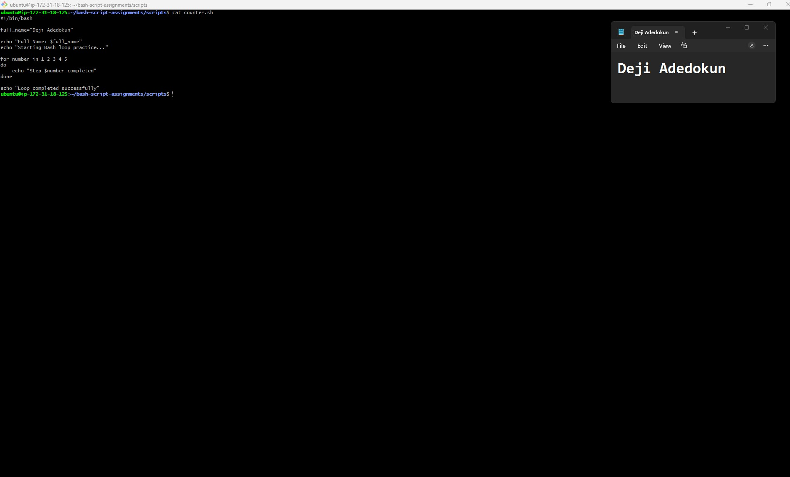

---

#### Screenshot 2 — Output of `./counter.sh`

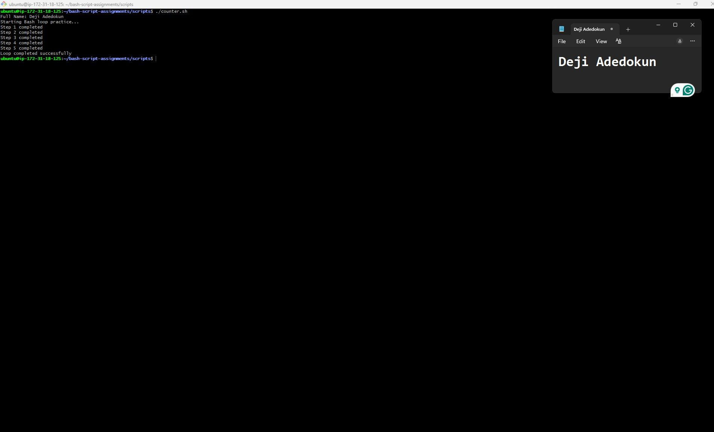

---

### Notes

Answer the following in your own words:

**1. What is a loop?**

A loop is a programming construct that repeatedly executes a block of code until a specified condition is met or until all items in a list have been processed. Loops help automate repetitive tasks and reduce the need to write the same code multiple times.

---

**2. Why do we use loops in Bash scripting?**

Loops are used in Bash scripting to automate repetitive actions, making scripts more efficient, readable, and easier to maintain. They are particularly useful when working with lists of files, directories, users, servers, or array elements, allowing the same operation to be performed multiple times without duplicating code.

---

**3. How many times did the loop run in your script?**

The loop ran 5 times because the for loop iterates over the five values specified, for number in 1 2 3 4 5.

---

**4. What would you change if you wanted the loop to run 10 times?**

To make the loop run 10 times, I would modify the for loop to iterate through the numbers 1 to 10, either by listing the numbers explicitly or by using the range {1..10}.

---

# Task 6 — Files & Conditionals: File Validation Script

## Goal

Use file checks and conditionals to verify whether files and directories exist.

### Evidence

#### Screenshot 1 — Output of `ls -lah ../test-folder`

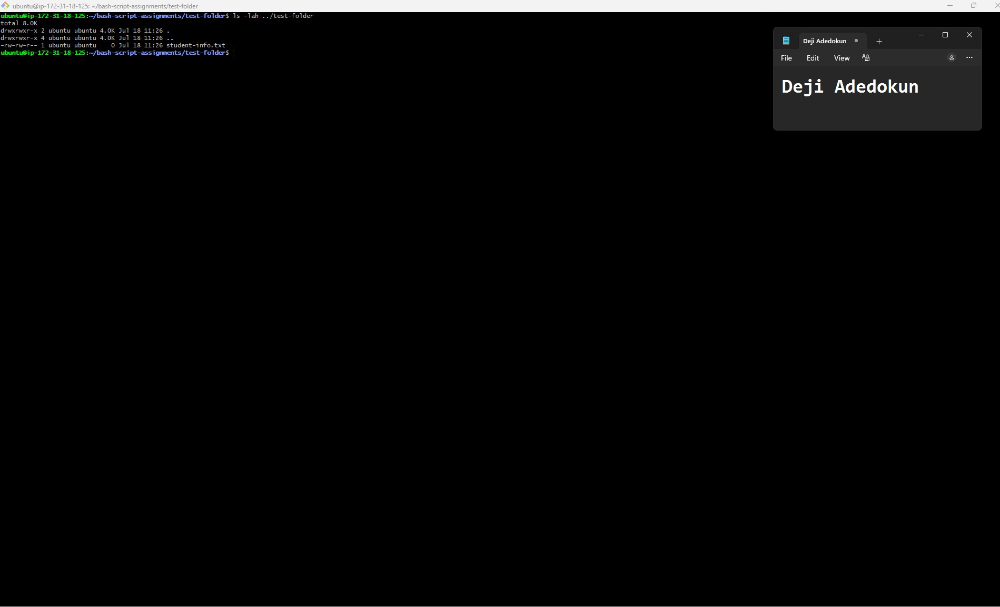

---

#### Screenshot 2 — Content of `file-check.sh`

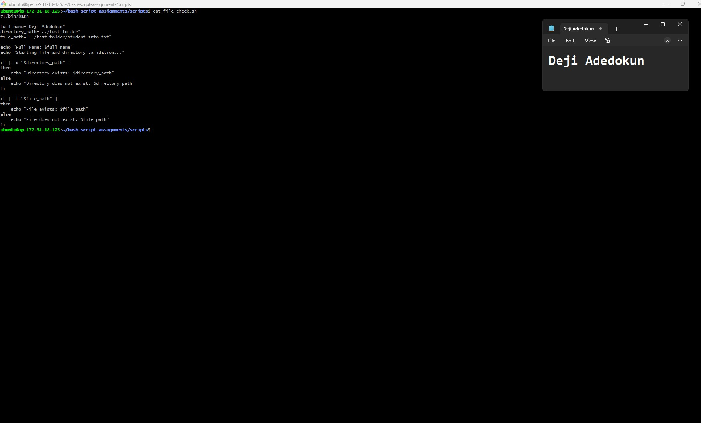

---

#### Screenshot 3 — Output of `./file-check.sh`

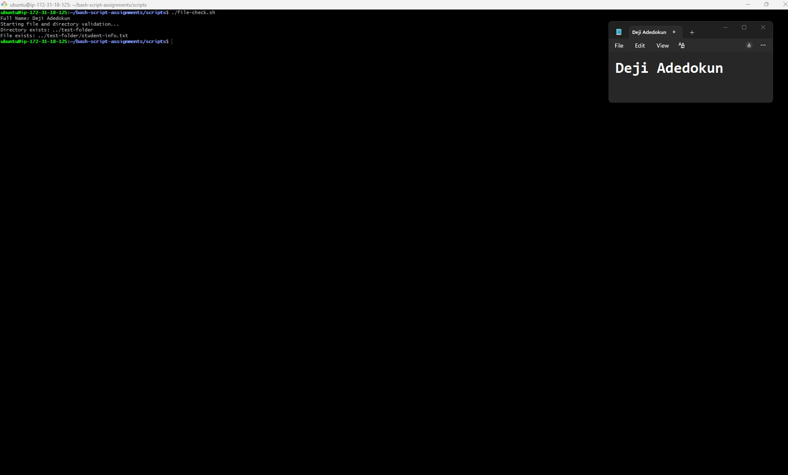

---

### Notes

Answer the following in your own words:

**1. What does `-d` check in Bash?**

The -d test operator checks whether a specified path exists and is a directory. 

---

**2. What does `-f` check in Bash?**

The -f test operator checks whether a specified path exists and is a regular file. 
---

**3. Why should file and directory paths be stored in variables?**

File and directory paths should be stored in variables because it makes scripts easier to read, maintain, and update. Instead of changing a path in multiple places throughout a script, you only need to update the variable once. This reduces errors, improves code organization, and makes the script more flexible.

---

**4. What happens if the file does not exist?**

If the file does not exist, a test using -f will evaluate to false, and the script can execute alternative actions, such as displaying an error message or creating the file.

---

# Task 7 — Conditionals: Pass or Retry Script

## Goal

Use if-else conditionals to make decisions based on a variable value.

### Evidence

#### Screenshot 1 — Content of `score-check.sh` with `score=85`

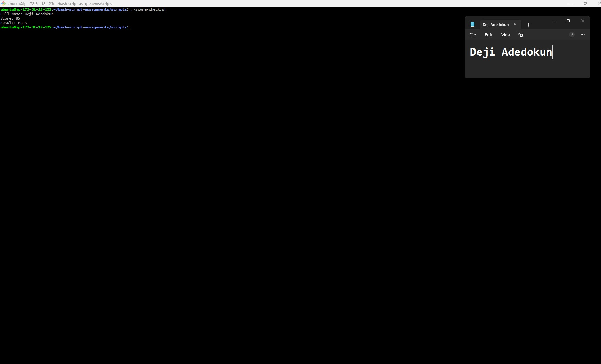

---

#### Screenshot 2 — Output showing `Result: Pass`

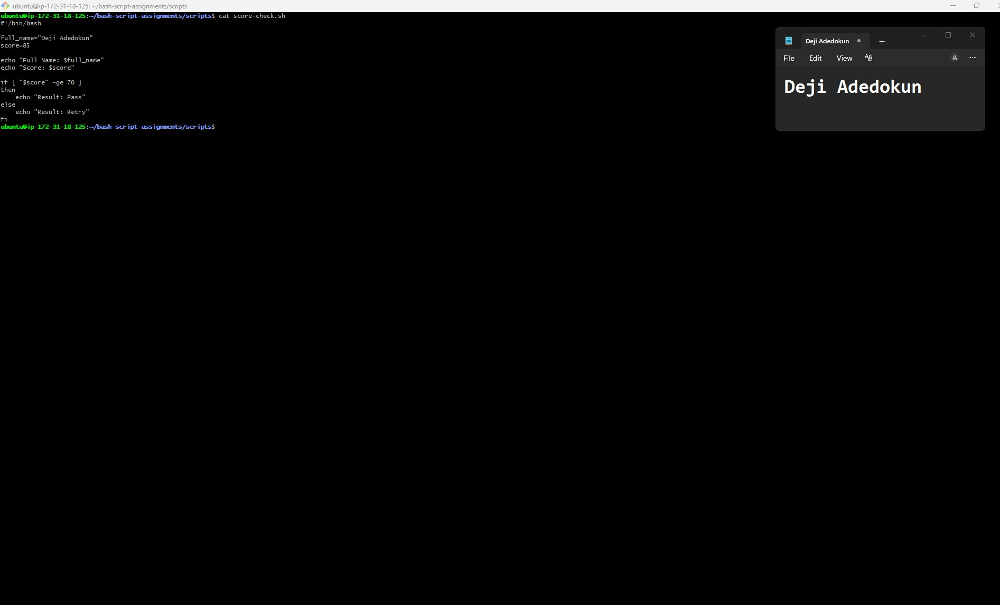

---

#### Screenshot 3 — Content of `score-check.sh` with `score=55`

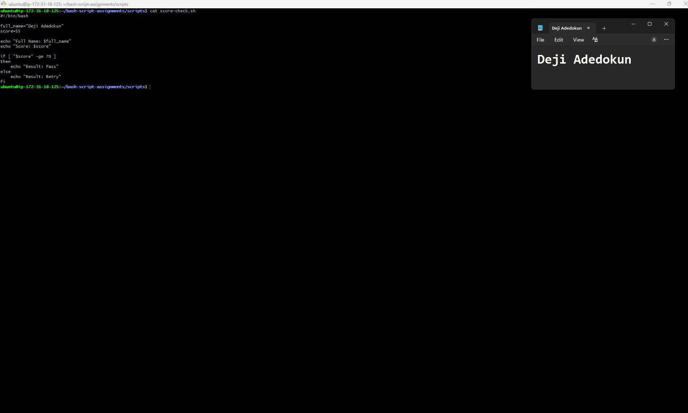

---

#### Screenshot 4 — Output showing `Result: Retry`

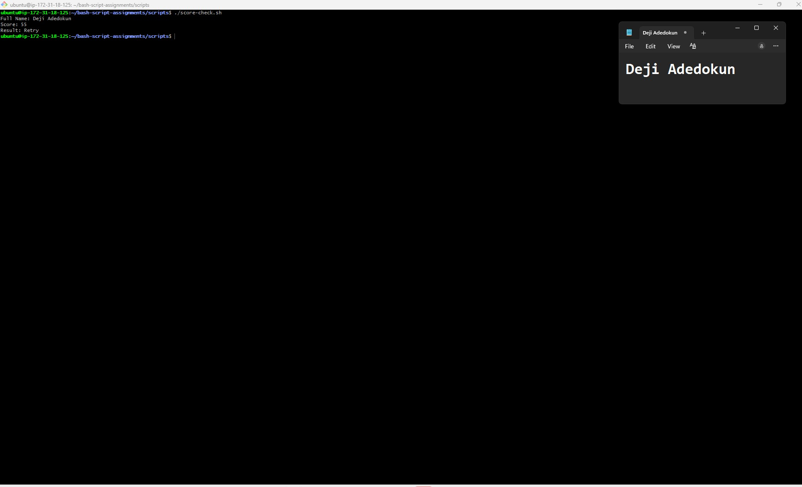

---

### Notes

Answer the following in your own words:

**1. What is the purpose of if-else in Bash?**

The if-else statement in Bash is used to make decisions based on conditions. It allows a script to execute one block of code when a condition is true and a different block when the condition is false. This helps scripts respond dynamically to different situations and inputs.

---

**2. What does `-ge` mean?**

The -ge operator stands for "greater than or equal to" and is used to compare numeric values in Bash.​‌

---

**3. Why should conditions be tested with different values?**

Conditions should be tested with different values to ensure that all possible outcomes are handled correctly. Testing helps identify errors, verify that the script behaves as expected, and confirms that both the true and false branches of the conditional logic work properly.

---

**4. How can conditionals help in automation scripts?**

Conditionals help in automation scripts by enabling scripts to make decisions automatically based on specific criteria. For example, a script can check whether a file exists, whether a service is running, or whether disk usage exceeds a certain threshold, and then take the appropriate action. This makes automation more intelligent, reliable, and capable of handling different scenarios without manual intervention.

---

# Task 8 — Functions: Final Bash Automation Script

## Goal

Create a final Bash script using functions to organize reusable code.

### Evidence

#### Screenshot 1 — Content of `final-automation.sh`

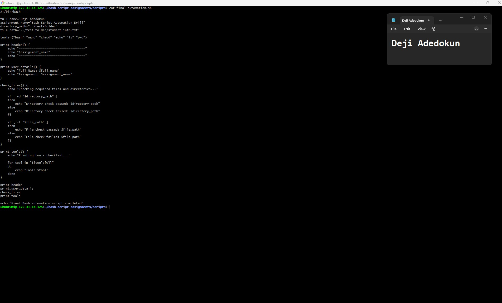

---

#### Screenshot 2 — Output of `./final-automation.sh`

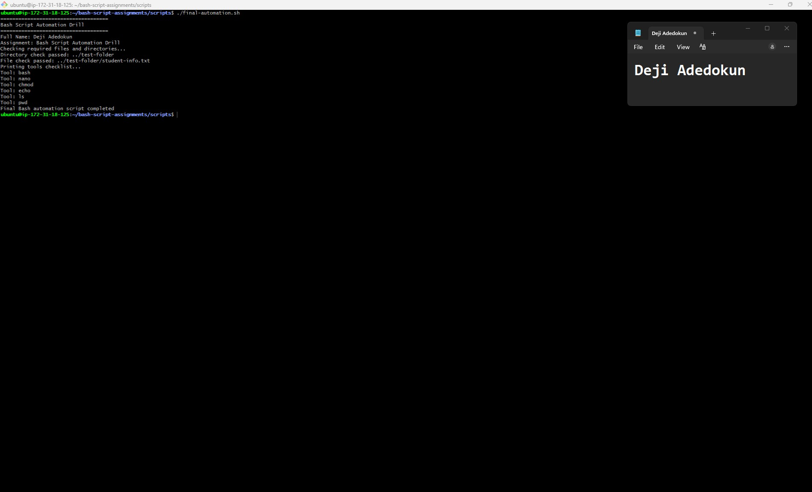

---

#### Screenshot 3 — Output of `ls -lah` showing all created scripts

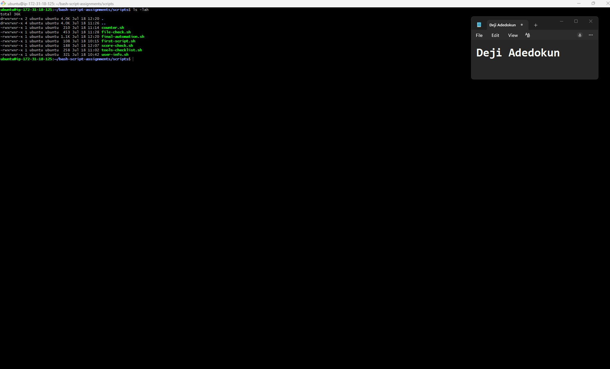

---

### Notes

Answer the following in your own words:

**1. What is a function in Bash?**

A function in Bash is a reusable block of code that performs a specific task. Instead of writing the same commands multiple times, you can place them inside a function and call the function whenever needed. Functions help organize scripts and make them easier to read and maintain.
---

**2. Why are functions useful in scripts?**

Functions are useful because they promote code reuse, reduce repetition, and improve script readability. They allow related commands to be grouped together under a meaningful name, making scripts more structured, easier to maintain, and simpler to troubleshoot or modify in the future.

---

**3. Which functions did you create in this script?**

The script contains four functions:

print_header() – Displays the automation assignment title and formatting header.
print_user_details() – Prints the user's full name and assignment name.
check_files() – Checks whether the specified directory and file exist using conditional statements.
print_tools() – Loops through the tools array and displays each tool in the checklist.

---

**4. How does this final script combine variables, arrays, loops, conditionals, files, and functions?**

This script combines several Bash concepts into a single automation workflow. It uses variables to store information such as the user's name, assignment name, and file paths. It uses an array to store a list of Bash tools. A for loop iterates through the array and prints each tool. Conditional statements (if-else) are used to check whether the specified directory and file exist. The script interacts with the filesystem by validating files and directories using the -d and -f operators. Finally, all these operations are organized into functions, which improve the script's structure, reusability, and readability. Together, these components demonstrate how Bash can be used to automate routine system administration and validation tasks efficiently.

---

# LinkedIn Post (Required)

## Evidence

#### LinkedIn Post URL

Paste your LinkedIn post URL here:

`https://www.linkedin.com/posts/deji-adedokun-82a7aa24b_finally-tried-my-hand-at-bash-automation-ugcPost-7484224472451985408-BdX8/?utm_source=share&utm_medium=member_desktop&rcm=ACoAAD3gNiIBphPW8KBk8LtPb0YfYY27Y457EIw`

---

#### Screenshot — Published LinkedIn post

---

# Submission Instructions

- Add all required screenshots in your submission
- Full name must be visible in required screenshots
- All script files must be created and run successfully
- Required notes must be answered clearly for every task
- Do not expose sensitive information (keys, passwords, credentials)

---

# Completion Checklist

- [ ] Task 1: Environment setup verified, workspace created (Screenshots 1–2, Notes answered)
- [ ] Task 2: First script created, executed, permissions verified (Screenshots 1–3, Notes answered)
- [ ] Task 3: Variables script created and run (Screenshots 1–2, Notes answered)
- [ ] Task 4: Arrays and loops script created and run (Screenshots 1–2, Notes answered)
- [ ] Task 5: Counter loop script created and run (Screenshots 1–2, Notes answered)
- [ ] Task 6: File validation script created and run (Screenshots 1–3, Notes answered)
- [ ] Task 7: Pass/Retry conditional script tested with both values (Screenshots 1–4, Notes answered)
- [ ] Task 8: Final automation script created and run (Screenshots 1–3, Notes answered)
- [ ] All scripts run without errors
- [ ] Full Name visible in all required screenshots
- [ ] LinkedIn post published and URL submitted
- [ ] No sensitive data exposed

---

## 📌 About DMI & CloudAdvisory

DevOps Micro Internship (DMI) is a project-based DevOps program run by Pravin Mishra (The CloudAdvisory) focused on real-world execution, systems thinking, and career readiness.

It helps learners build strong DevOps foundations with hands-on experience.

---

## 📌 Resources

- 🌐 DMI Official Website: https://pravinmishra.com/dmi  
- 🎓 DevOps for Beginners (Udemy): https://www.udemy.com/course/devops-for-beginners-docker-k8s-cloud-cicd-4-projects/  
- 🎓 Agentic AI DevOps with Claude Code: https://www.udemy.com/course/ultimate-agentic-ai-devops-with-claude-code/  
- 🎓 DevOps with Claude Code: Terraform, EKS, ArgoCD & Helm: https://www.udemy.com/course/devops-with-claude-code-terraform-eks-argocd-helm/  
- ▶️ YouTube Playlist: https://www.youtube.com/playlist?list=PLFeSNDtI4Cho  
- 🔗 Pravin Mishra (LinkedIn): https://www.linkedin.com/in/pravin-mishra-aws-trainer/  
- 🏢 CloudAdvisory (LinkedIn): https://www.linkedin.com/company/thecloudadvisory/

---

*This submission is part of DevOps Micro Internship (DMI) Cohort 3 — Agentic AI Track.*