# Assignment 6 — Build an AI-Assisted Linux Health Check (AI-Assisted Linux Incident Triage)

Part of the DevOps Micro Internship (DMI) Cohort 3 with Agentic AI

---

## Purpose

In this assignment, you will build a read-only Bash triage script that checks the health of your Ubuntu server and Nginx application, connect it to Claude Code as a reusable `/linux-triage` skill, simulate a controlled Nginx incident, use the skill to gather and analyze evidence, recover the service manually, and verify recovery. The workflow follows the Agentic Loop: Gather → Analyze → Human Act → Verify.

---

# Task 1 — Confirm the Healthy Baseline and Create the Workspace

## Goal

Confirm that Nginx and the React application are healthy before building the automation.

### Evidence

#### Screenshot 1 — Output of `systemctl is-active nginx`, `ss -ltn | grep ':80'`, and `curl -I http://localhost`

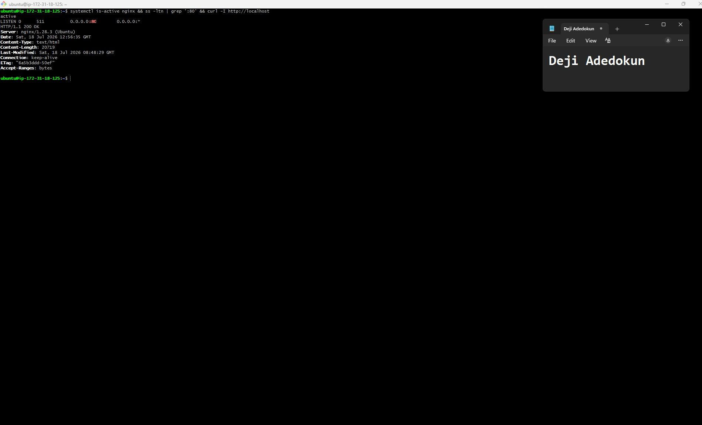

---

#### Screenshot 2 — Output of `pwd` and `find . -maxdepth 4 -type d | sort` showing the workspace folder structure

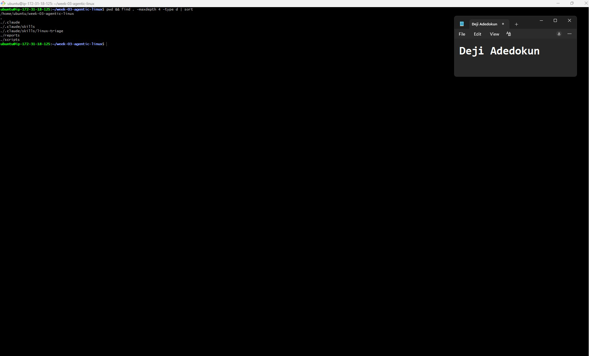

---

### Notes

Answer the following in your own words:

**1. What proves that Nginx is running?**

Output of systemctl is-active nginx showing as 'active'.

---

**2. What proves that the server is listening for HTTP traffic?**

Running ss -ltn | grep ':80', this helps to check if a service is listening on the http port 80.

---

**3. Why must you capture a healthy baseline before simulating an incident?**

It is important to capture a healthy baseline before simulating an incident because it provides a clear reference point for how the system behaves under normal operating conditions.

---

# Task 2 — Create Project Context and Safety Rules in CLAUDE.md

## Goal

Tell Claude exactly what this project does and what it is not allowed to do.

### Evidence

#### Screenshot 3 — CLAUDE.md open in VS Code showing all four sections (Project Overview, Incident Workflow, Safety Rules, Output Rules)

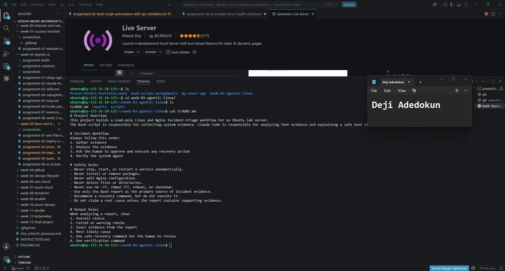

---

### Notes

Answer the following in your own words:

**1. Why should Claude receive project-specific operational rules?**

Claude should receive project-specific operational rules to ensure its analysis and recommendations align with the project's objectives, workflows, and safety requirements. In this case, the rules clearly define Claude's role as an incident-analysis assistant that uses the Bash report as evidence, follows a structured incident workflow, and avoids making changes to the system. These guidelines help ensure consistent, safe, and reliable incident triage.

---

**2. Why is the human required to execute the recovery command?**

The human is required to execute the recovery command because the safety rules explicitly state that Claude may recommend a recovery command but must not execute it. This ensures that an authorized person reviews the recommendation, confirms it is appropriate for the situation, and maintains control over changes made to the system. Human approval reduces the risk of unintended actions affecting production services.

---

**3. Which rule prevents Claude from making an unsupported diagnosis?**

The rule that prevents Claude from making an unsupported diagnosis is:

"Do not claim a root cause unless the report contains supporting evidence."

This rule ensures that Claude bases its conclusions only on facts and evidence found in the Bash report rather than making assumptions or speculative diagnoses. As a result, any identified cause must be supported by the incident data collected during the investigation.

---

# Task 3 — Use Agentic AI to Plan Before Writing the Script

## Goal

Use Claude Code to inspect the environment and produce a read-only plan before creating any Bash code.

### Evidence

#### Screenshot 4 — Claude Code showing the five-check plan and read-only inspection results

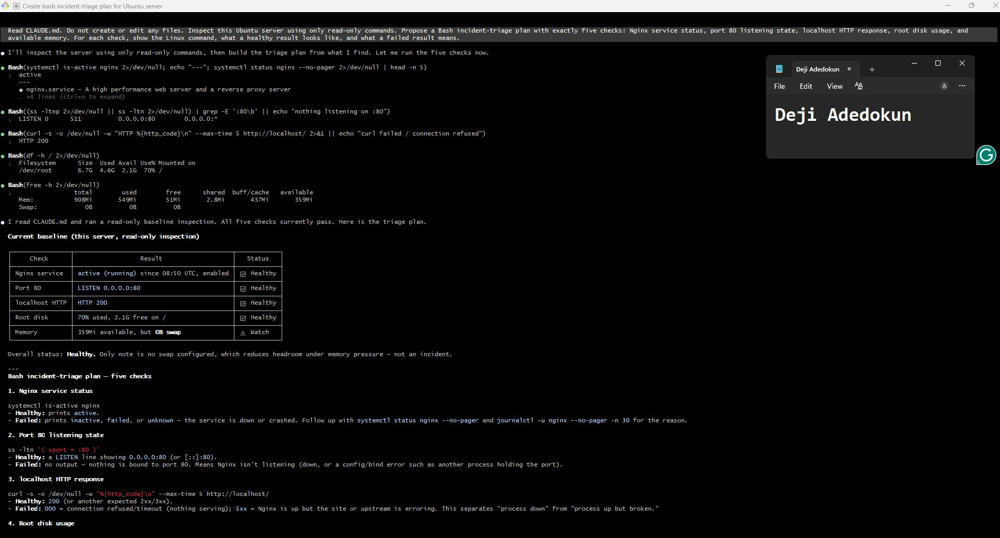

---

### Notes

Answer the following in your own words:

**1. Which part of this task represents the Gather phase?**

The first phase gathers all required script and explaining what every does.

---

**2. Did Claude follow the instruction not to create files? How did you verify this?**

Yes

---

**3. Why is planning before coding useful in DevOps automation?**

Planning before coding is useful in DevOps automation because it helps teams design reliable, efficient, and maintainable solutions before implementation begins.

---

# Task 4 — Build the Linux Triage Bash Script

## Goal

Create one Bash script that gathers consistent Linux and Nginx health evidence.

### Evidence

#### Screenshot 5 — Top section of `linux-triage.sh` showing variables, thresholds, and the checks array

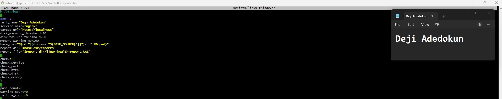

---

#### Screenshot 6 — Middle section showing check functions and conditionals

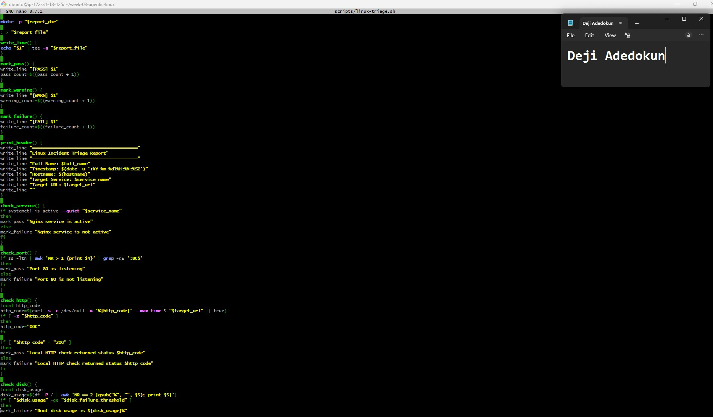

---

#### Screenshot 7 — Bottom section showing the loop, summary function, and exit behavior

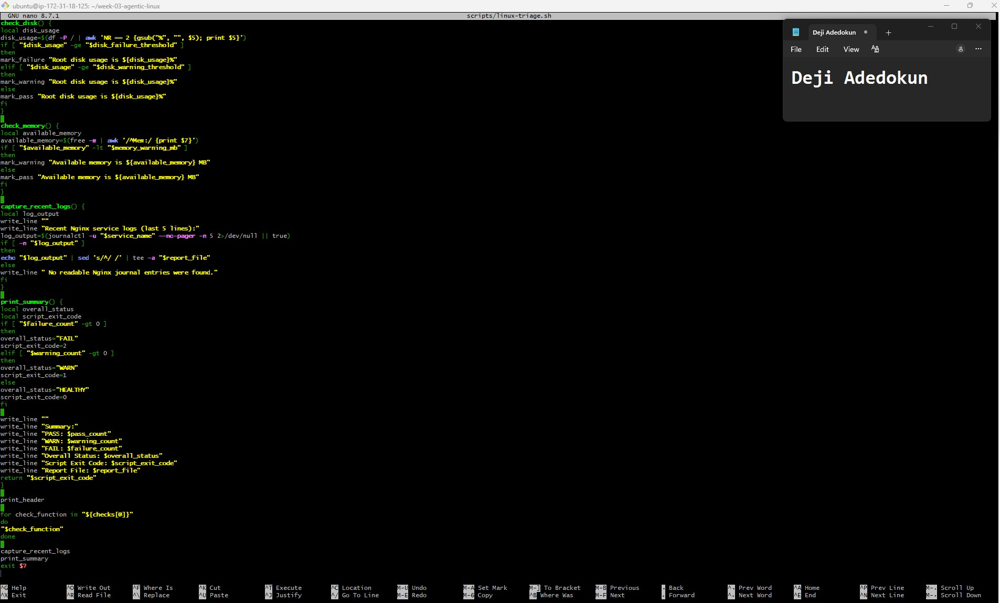

---

#### Screenshot 8 — Output of `bash -n scripts/linux-triage.sh` (no syntax errors) and `ls -l scripts/linux-triage.sh` showing executable permission

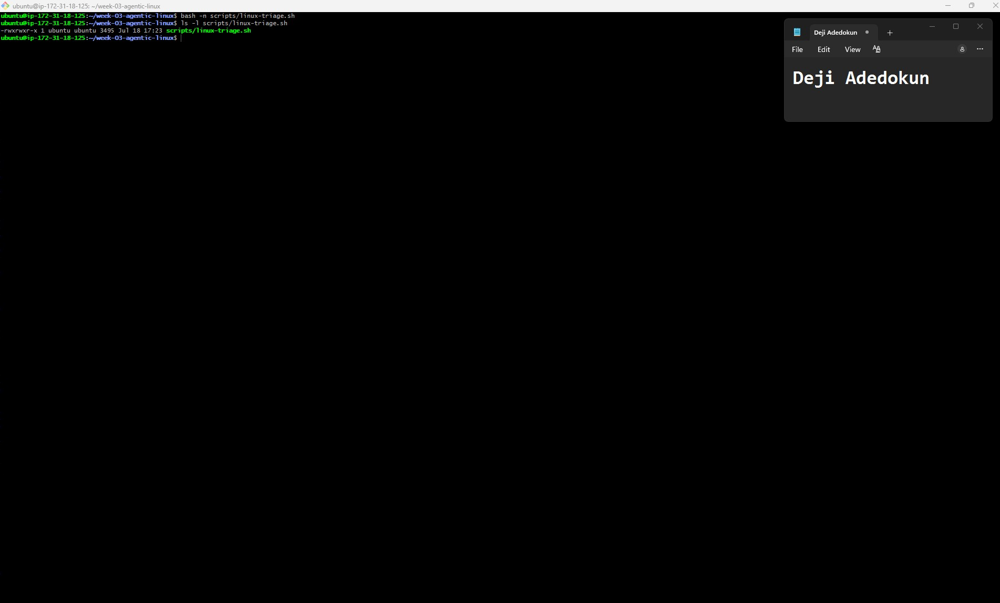

---

### Notes

Answer the following in your own words:

**1. What is stored in the checks array?**

The array stores these five strings: check_service, check_port, check_http, check_disk.
check_memory

---

**2. How does the `for` loop use that array?**

The for helps run the through each array entry listed above.

---

**3. Why are the health checks separated into functions?**

separating checks into functions turns a flat, repetitive script into a small, extensible "framework" — new checks can be plugged into the same array/loop/reporting system with minimal code, and each check stays isolated, testable, and readable on its own.

---

**4. What is the purpose of `$(...)` in this script?**

It is a command substitution. It runs the command inside the parentheses, and replaces $(...) with whatever that command prints to standard output (as text).

---

**5. Why does the script use different exit codes for HEALTHY, WARN, and FAIL?**

Returning distinct exit codes turns this script from something only a human can interpret into something other software can act on automatically — which is the whole point of a health-check script meant for real infrastructure monitoring, not just a one-off report

---

# Task 5 — Run and Understand the Healthy-State Report

## Goal

Run the Bash script against the healthy server and verify that it creates a report.

### Evidence

#### Screenshot 9 — Output of `./scripts/linux-triage.sh` showing your Full Name and all five check results

---

#### Screenshot 10 — Output showing the captured exit code and final summary

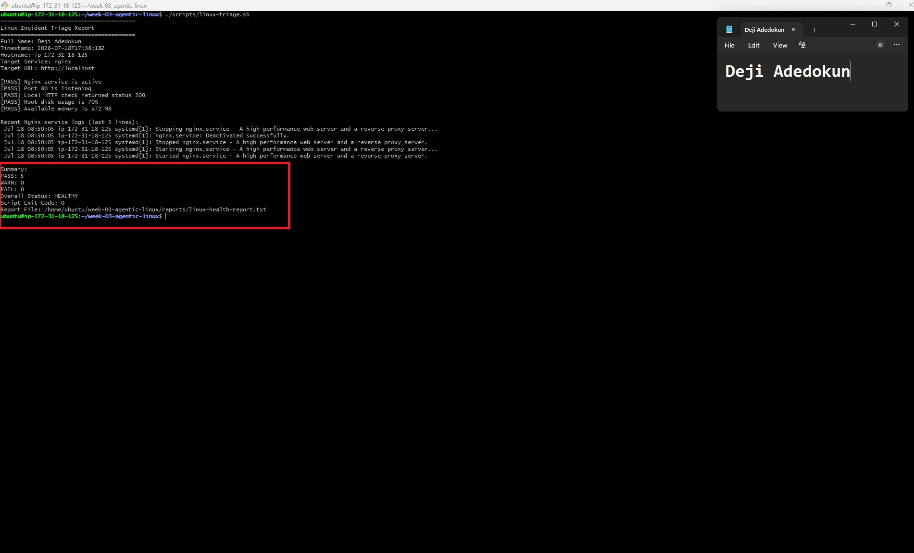

---

### Notes

Answer the following in your own words:

**1. What is the overall status of your healthy baseline?**

HEALTHY

---

**2. Which exact Linux evidence proves the application is serving traffic?**

[PASS] Port 80 is listening

---

**3. Did your script return exit code 0 or 1? Explain why.**

It returns 0, cause all process pass.

---

**4. What is the difference between a warning and a failure in this script?**

The difference is about severity and what triggers each, and it maps directly to real operational meaning.

---

# Task 6 — Create and Run the /linux-triage Skill

## Goal

Turn the Bash script into a reusable, manually invoked Agentic AI workflow.

### Evidence

#### Screenshot 11 — `SKILL.md` showing the frontmatter, allowed tool restrictions, and safety rules

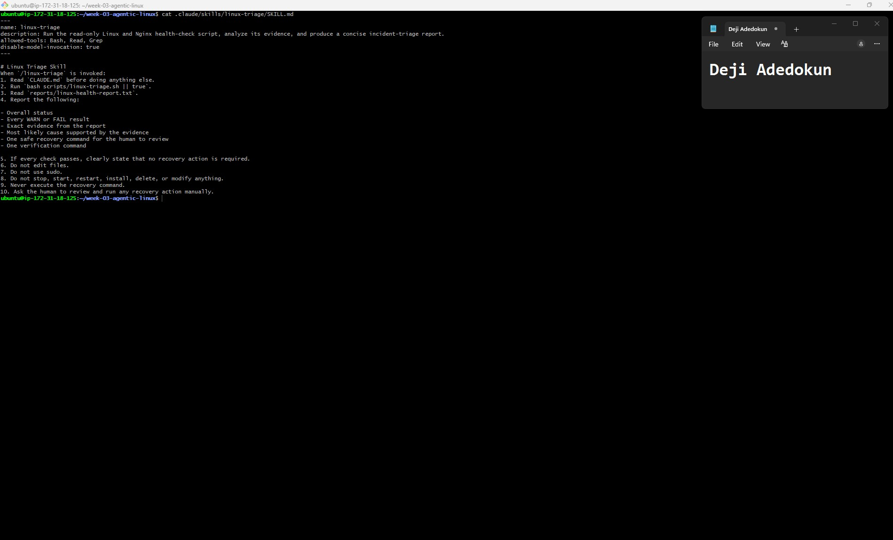

---

#### Screenshot 12 — `/linux-triage` output for the healthy server

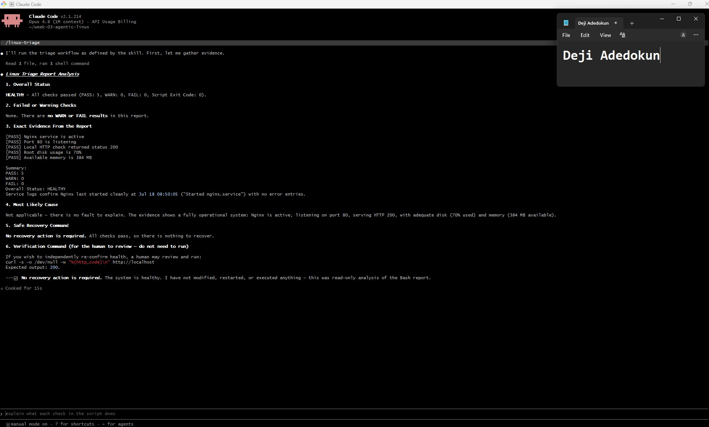

---

### Notes

Answer the following in your own words:

**1. Why does this skill have Bash, Read, and Grep, but not Write?**

This is beacuase it is meant to be a read-only Linux and Nginx health-check script.

---

**2. Why is `disable-model-invocation: true` useful for this skill?**

disable-model-invocation: true controls how the skill can be triggered — specifically, it prevents Claude from deciding on its own, mid-conversation, to invoke this skill automatically.

---

**3. What part is performed by Bash, and what part is performed by Claude?**

BASH:
    Runs the script.
    Retrieves the report file's raw text.

CLAUDE:
    Reads CLAUDE.md for context.
    Interprets the report (what's PASS/WARN/FAIL).
    Diagnoses probable root cause.
    Drafts recovery + verification commands.
    Decides what to say to the human, and what not to do.

---

**4. Why is this better than asking Claude "Is my server healthy?" without giving it evidence?**

Giving Claude the script's evidence turns the question from "guess what's probably wrong with a typical Linux server" into "tell me what's actually wrong with this specific server, right now, based on real data" — which is the difference between a plausible-sounding hallucination and an actual, verifiable diagnosis.

---

# Task 7 — Simulate an Nginx Incident and Let the Skill Diagnose It

## Goal

Create a controlled service failure, gather evidence through Bash, and let Claude analyze the evidence without taking recovery action.

### Evidence

#### Screenshot 13 — Output showing Nginx is inactive and the HTTP request fails

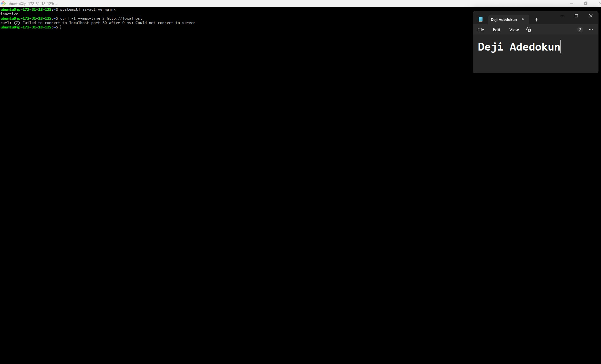

---

#### Screenshot 14 — `/linux-triage` output showing failed evidence, most likely cause, and a suggested recovery command

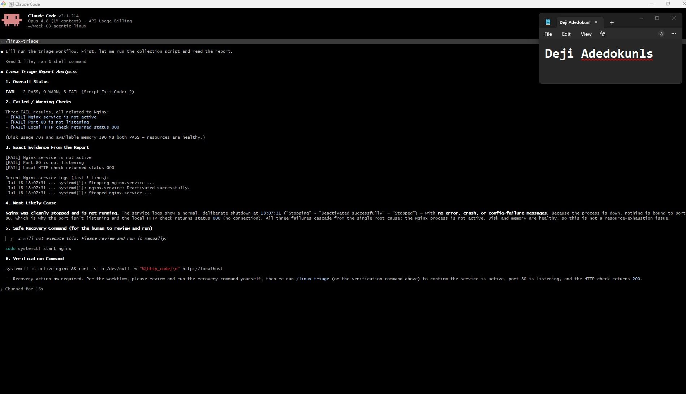

---

#### Screenshot 15 — `incident-failure-report.txt` showing the failed checks and your Full Name

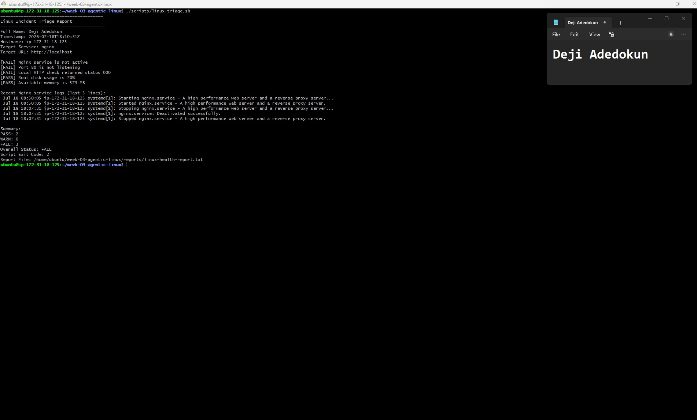

---

### Notes

Answer the following in your own words:

**1. Which three checks failed?**

[FAIL] Nginx service is not active
[FAIL] Port 80 is not listening
[FAIL] Local HTTP check returned status 000

---

**2. What evidence supports the conclusion that Nginx is unavailable?**

systemctl is-active nginx returns inactive.

---

**3. Did Claude execute the recovery command? Why is that important?**

No, claude would give recommendations actions, it is a human intervention to decide to go ahead with the recommendations.

---

**4. Which phase of the Agentic Loop is represented by the Bash report?**

The pattern so far is (Bash executes and retrieves raw facts, Claude interprets and reasons over them), the Bash report corresponds to the "Gather Context" / "Take Action" phase of the Agentic Loop — specifically, it's the evidence-gathering step, not the reasoning or verification step.

---

**5. Which phase is represented by Claude's explanation?**

Gather - gather context

---

# Task 8 — Recover Manually, Verify Again, and Write the Incident Summary

## Goal

Recover the service as the human operator and prove that the system is healthy again.

### Evidence

#### Screenshot 16 — Output showing Nginx is active and `curl -I http://localhost` returns 200 OK

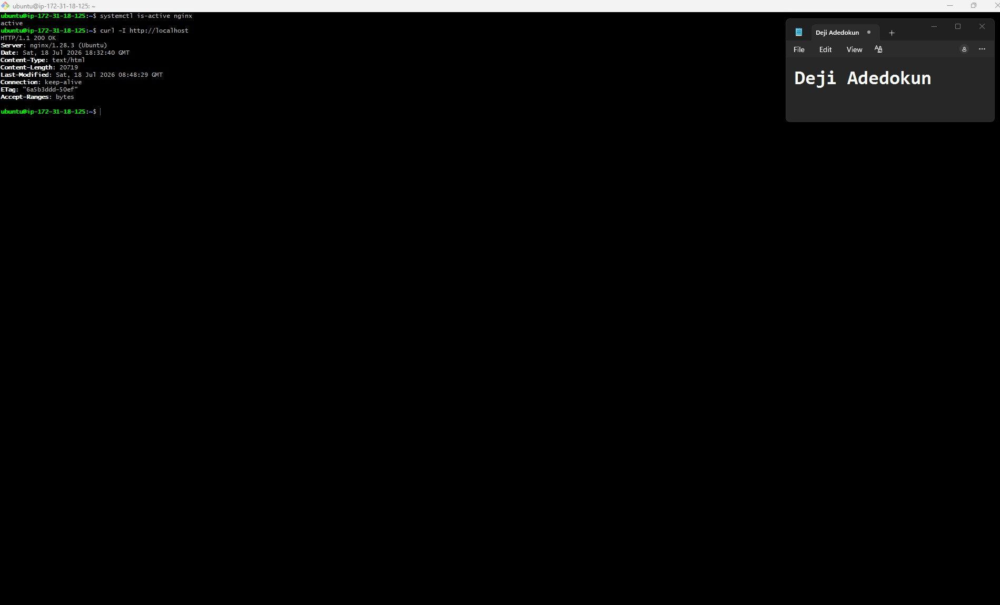

---

#### Screenshot 17 — Second `/linux-triage` output showing successful recovery with no FAIL results

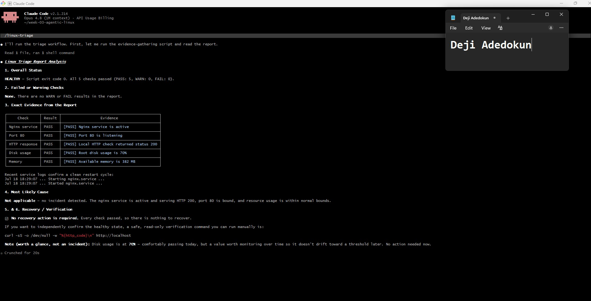

---

#### Screenshot 18 — Output of `ls -lah reports` showing both `incident-failure-report.txt` and `recovery-report.txt`

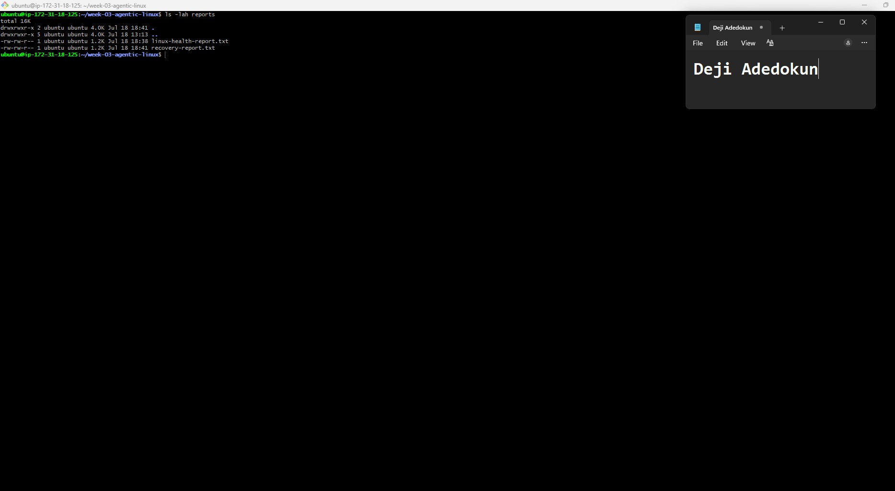

---

#### Screenshot 19 — `incident-summary.md` showing all required sections and your Full Name

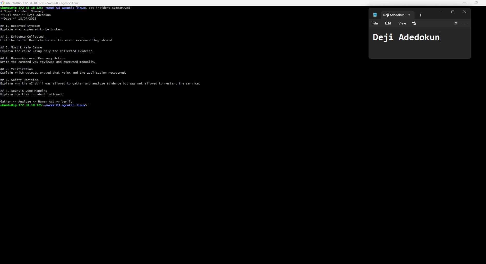

---

### Notes

Answer the following in your own words:

**1. What action did you execute manually?**

Restarting the nginx service.

---

**2. What evidence proves that the service recovered?**

curl -I http://localhost shoing 200 Ok and service showing active.

---

**3. Why is the second triage run necessary?**

It is necessary to bring back up all necessary services.

---

**4. What could go wrong if an AI agent automatically restarted every failed service?**

An AI agent that automatically restarts every failed service sounds useful, but it can create serious reliability, security, and operational problems if it does so without context

---

**5. In one sentence, explain the difference between using AI as a chatbot and using AI in this agentic workflow.**

A chatbot uses AI to answer questions and generate responses, while an agentic workflow uses AI to make decisions and take actions autonomously within a system to achieve a goal

---

# Incident Summary

Fill in all seven sections below in your own words.

**Full Name:** Deji Adedokun

**Date:** 18/07/2026

---

**1. Reported Symptom**

Site unavailable.

---

**2. Evidence Collected**

Nginx service down and inactive.

---

**3. Most Likely Cause**

Stopped services.

---

**4. Human-Approved Recovery Action**

Restart service (systemctl start nginx).

---

**5. Verification**

nginx is-active.

---

**6. Safety Decision**

Agent review of recommendations via human intervention.

---

**7. Agentic Loop Mapping**

Goal → Observe4  →  Analyze / Reason →  Decide8 →  Act → Evaluate Result  → Adjust Plan → Repeat Until Goal Is Achieved

---

# LinkedIn Post (Required)

## Evidence

#### LinkedIn Post URL

Paste your LinkedIn post URL here:

`https://www.linkedin.com/posts/deji-adedokun-82a7aa24b_finally-tried-my-hand-at-bash-automation-ugcPost-7484224472451985408-BdX8/?utm_source=share&utm_medium=member_desktop&rcm=ACoAAD3gNiIBphPW8KBk8LtPb0YfYY27Y457EIw`

---

#### Screenshot — Published LinkedIn post

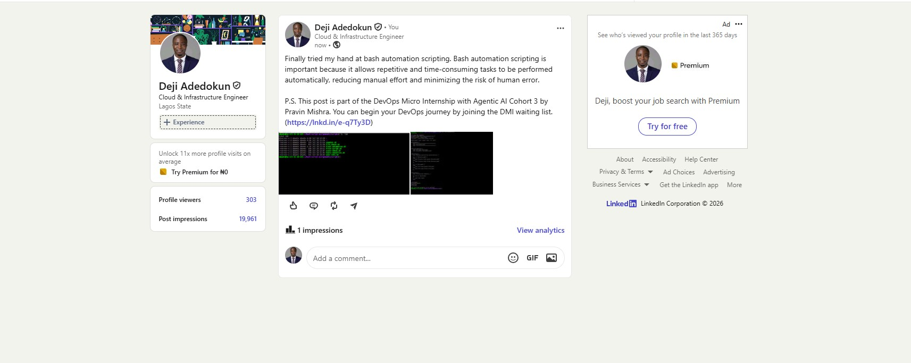

---

# GitHub Repository URL

Paste the URL of your GitHub folder or repository containing the assignment files here:

`Add your URL here`

---

# Submission Instructions

- Add all required screenshots in your submission
- Full Name must be visible in required screenshots and the Bash report
- All written answers must be in your own words
- Do not expose sensitive information (keys, passwords, AWS account IDs, tokens)
- GitHub URL must be included in this document

---

# Completion Checklist

- [ ] Task 1: Healthy baseline confirmed, workspace created (Screenshots 1–2, Notes answered)
- [ ] Task 2: CLAUDE.md created with all four sections (Screenshot 3, Notes answered)
- [ ] Task 3: Five-check plan produced by Claude using read-only tools (Screenshot 4, Notes answered)
- [ ] Task 4: `linux-triage.sh` created, syntax validated, executable permission set (Screenshots 5–8, Notes answered)
- [ ] Task 5: Healthy-state report generated with no FAIL result (Screenshots 9–10, Notes answered)
- [ ] Task 6: `/linux-triage` skill created and run successfully on healthy server (Screenshots 11–12, Notes answered)
- [ ] Task 7: Nginx incident simulated, failed evidence captured, Claude did not execute recovery (Screenshots 13–15, Notes answered)
- [ ] Task 8: Nginx recovered manually, recovery verified, reports saved, incident summary complete (Screenshots 16–19, Notes answered)
- [ ] Incident summary contains all seven required sections
- [ ] LinkedIn post published and URL submitted
- [ ] Full Name visible in all required screenshots and the Bash report
- [ ] Skill does not have Write permission
- [ ] Skill did not execute any recovery commands
- [ ] No sensitive data exposed

---

## 📌 About DMI & CloudAdvisory

DevOps Micro Internship (DMI) is a project-based DevOps program run by Pravin Mishra (The CloudAdvisory) focused on real-world execution, systems thinking, and career readiness.

It helps learners build strong DevOps foundations with hands-on experience.

---

## 📌 Resources

- 🌐 DMI Official Website: https://pravinmishra.com/dmi  
- 🎓 DevOps for Beginners (Udemy): https://www.udemy.com/course/devops-for-beginners-docker-k8s-cloud-cicd-4-projects/  
- 🎓 Agentic AI DevOps with Claude Code: https://www.udemy.com/course/ultimate-agentic-ai-devops-with-claude-code/  
- 🎓 DevOps with Claude Code: Terraform, EKS, ArgoCD & Helm: https://www.udemy.com/course/devops-with-claude-code-terraform-eks-argocd-helm/  
- ▶️ YouTube Playlist: https://www.youtube.com/playlist?list=PLFeSNDtI4Cho  
- 🔗 Pravin Mishra (LinkedIn): https://www.linkedin.com/in/pravin-mishra-aws-trainer/  
- 🏢 CloudAdvisory (LinkedIn): https://www.linkedin.com/company/thecloudadvisory/

---

*This submission is part of DevOps Micro Internship (DMI) Cohort 3 — Agentic AI Track.*